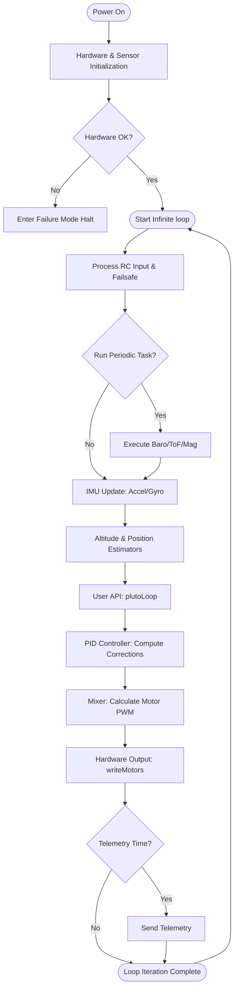

# MagisV2 Firmware Complete Execution & Subsystem Pipeline

This document outlines the core data flow, hardware abstraction, and execution pipeline of the MagisV2 flight controller firmware. The architecture is a customized derivative of Baseflight/Cleanflight, tailored to offer a developer-friendly C++ API layer (`PlutoPilot`) without disrupting the high-frequency control loops.

## 1. High-Level Control Loop Architecture

The firmware is structured around a central infinite loop (`loop()` in `main.cpp` calling `loop()` in `mw.cpp`). Execution follows a strict sequence prioritizing safety, sensor fusion, user-defined modifications, and motor mixing.

## Subsystem Documentation

The detailed algorithms and data flows for each core component are broken down into dedicated documents below:

- **[Main Initialization](subsystems/Main_Initialization.md)**
- **[RC Input Pipeline](subsystems/RC_Input_Pipeline.md)**
- **[Failsafe Subsystem](subsystems/Failsafe_Subsystem.md)**
- **[IMU & Sensor Fusion Pipeline](subsystems/IMU_Sensor_Fusion_Pipeline.md)**
- **[Altitude Hold & Estimator](subsystems/Altitude_Hold_Estimator.md)**
- **[Optic Flow & Position Control](subsystems/Optic_Flow_Position_Control.md)**
- **[User Space API](subsystems/User_Space_API.md)**
- **[Core PID Controller](subsystems/Core_PID_Controller.md)**
- **[Mixer Pipeline](subsystems/Mixer_Pipeline.md)**
- **[Motor Control & Hardware Output](subsystems/Motor_Control_Hardware_Output.md)**
- **[Telemetry Pipeline](subsystems/Telemetry_Pipeline.md)**
- **[Error & Failure Mode](subsystems/Error_Failure_Mode.md)**
- **[Power BMS Pipeline](subsystems/Power_BMS_Pipeline.md)**
- **[Hardware Bus Pipeline](subsystems/Hardware_Bus_Pipeline.md)**
- **[MSP Communications Pipeline](subsystems/MSP_Communications_Pipeline.md)**
