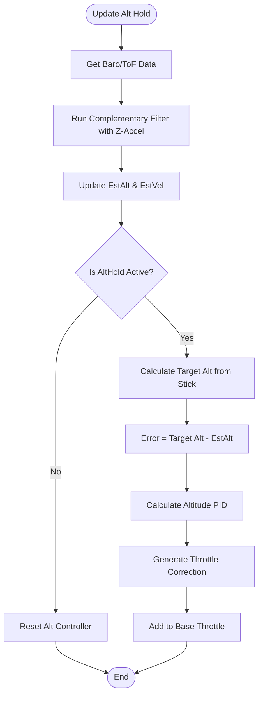

# Altitude Hold & Estimator (`altitudehold.cpp` / `posEstimate.cpp`)

## Overview
Fuses data from barometric pressure and laser Time-of-Flight (ToF) sensors along with the Accelerometer's Z-axis to estimate precise altitude and vertical velocity. When `ALT_HOLD` mode is active, it takes over the throttle channel to automatically maintain or smoothly adjust the drone's height.

## Source Files
- **Altitude Estimator**: `src/main/flight/posEstimate.cpp`, `src/main/flight/posEstimate.h`
- **Altitude Controller**: `src/main/flight/altitudehold.cpp`, `src/main/flight/altitudehold.h`
- **Sensors**: `src/main/sensors/barometer.cpp`, `src/main/drivers/ranging_vl53l0x.cpp`

## Key Data Structures
- `EstAlt`: The globally accessible estimated altitude in centimeters.
- `EstVel[Z]`: The estimated vertical velocity in cm/s.
- `alt.EstAlt`: The internal controller reference variable.
- `rcCommand[THROTTLE]`: The throttle stick input, which is hijacked to represent target vertical velocity rather than direct motor power.

## Primary Functions
- `updateZVelocity()` / `updateZPosition()`: Uses a Complementary Filter or basic Kalman approach to fuse the high-frequency Accel-Z data with the low-frequency, drifty Barometer/ToF data.
- `applyAltHold()`: The PID controller specifically for the Z-axis. It calculates the error between the target altitude and `EstAlt`.
- `calculateBaseThrottle()`: Computes the base hover throttle needed to counteract gravity, injecting the Altitude PID correction to output the final `rcCommand[THROTTLE]`.

## Data Flow & Boundaries
- **Deadband**: When in `ALT_HOLD`, a deadband (e.g., `alt_hold_deadband`) is applied to the throttle stick. If the stick is in the middle, the drone holds altitude. If pushed up/down beyond the deadband, it enters climb/descend mode.
- **ToF vs Baro**: The ToF sensor (VL53L0X/VL53L1X) is highly accurate but bounded to ~2 meters. Above this range, the estimator relies purely on the Barometer and Z-Accel integration.

