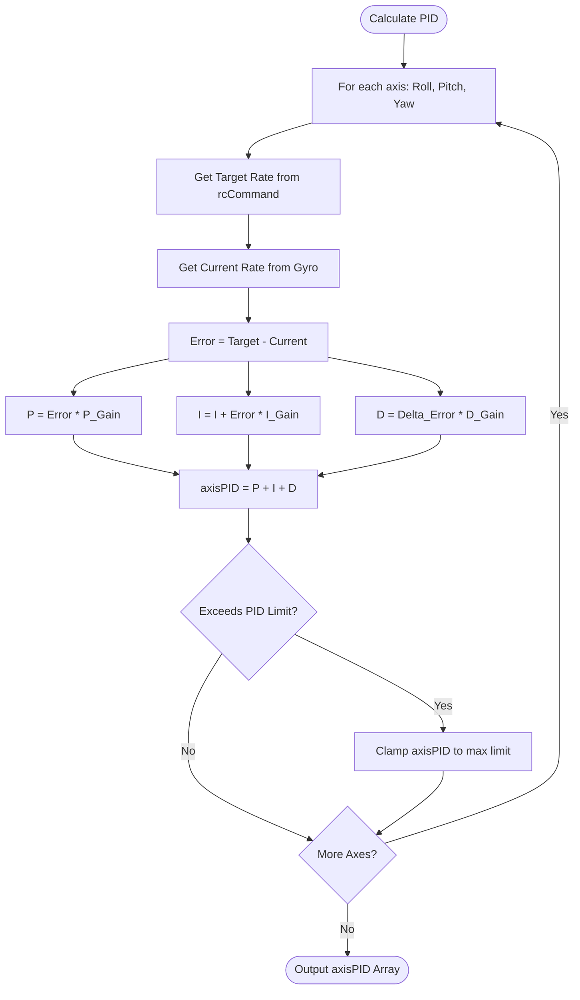

# Core PID Controller (`pid.cpp`)

## Overview
The PID (Proportional, Integral, Derivative) controller is the stabilizing brain of the drone. It compares the pilot's requested rotation rates (`rcCommand`) against the drone's actual physical rotation rates (from the IMU), and computes a mathematical error. It then outputs a correction value (`axisPID`) that is sent to the Mixer.

## Source Files
- **Controller Logic**: `src/main/flight/pid.cpp`, `src/main/flight/pid.h`
- **Profile Config**: `src/main/config/config_profile.h`
- **User API Hook**: `src/main/API-Src/FC-Config-PID.cpp`

## Key Data Structures
- `rcCommand[3]`: The target rates commanded by the user/GCS.
- `gyroADC[3]`: The current actual rotation rates in degrees per second.
- `axisPID[3]`: The final computed correction (-1000 to +1000) for Roll, Pitch, and Yaw.
- `pidProfile_t`: Holds the tuned P, I, and D multipliers.

## Primary Functions
- `pidController()`: The core execution loop. It iterates through the Roll, Pitch, and Yaw axes, computing the error and multiplying by the PID gains.
- `applyGyroData()`: Injects the raw IMU data into the PID logic.
- `plutoLoop()` (API): If an API application is active, it may intercept `axisPID` or `rcCommand` to inject autonomous flight corrections before the Mixer.

## Data Flow & Boundaries
- **P-Term Limit**: The Proportional correction is usually clamped to prevent an instantaneous massive error (like a prop strike) from commanding 100% motor output instantly.
- **I-Term Windup**: To prevent the Integral term from accumulating endlessly when the drone is on the ground or physically constrained (Anti-Windup), it is strictly bounded (e.g., `pidProfile->pid[axis].I`).
- **D-Term Filtering**: The Derivative term calculates the *rate of change* of the error. Because differentiation amplifies high-frequency noise, the D-term operates on heavily filtered gyro data or error deltas to prevent motor smoking.

