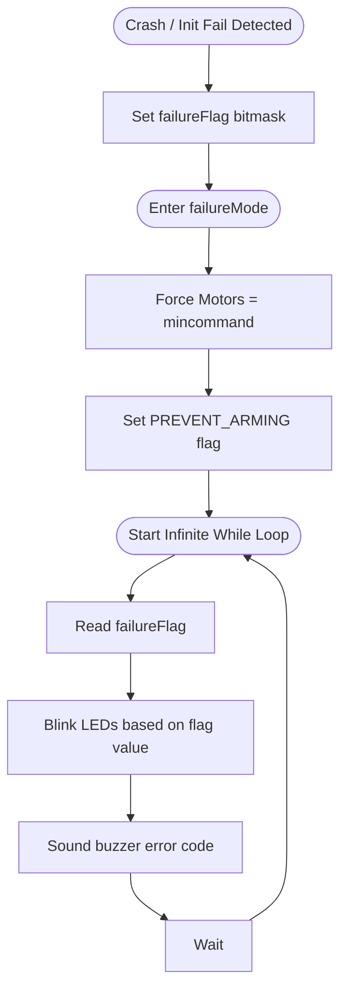

# Error & Failure Mode (`main.cpp`)

## Overview
If hardware initialization fails (e.g., missing IMU) or a fatal runtime error occurs (like a hard crash exceeding accelerometer/gyro limits), the system enters a safe halt state. This state explicitly blocks arming and locks up the main thread to prevent unsafe flight. It can only be cleared by a physical power cycle.

## Source Files
- **Error Handlers**: `src/main/main.cpp`, `src/main/flight/failsafe.cpp`
- **Audio/Visual Indicators**: `src/main/io/beeper.cpp`, `src/main/io/ledstrip.c`

## Key Data Structures
- `failureMode`: A global integer flag indicating the specific error code (e.g., `1` = IMU missing, `2` = I2C Bus Locked).
- `arm_state`: Forces `ARMING_DISABLED` state.
- `motor[MAX_SUPPORTED_MOTORS]`: Array forced to `mincommand` to physically stop output.

## Primary Functions
- `failureMode(uint8_t mode)`: The entry function. Called when a fatal system error is detected. It immediately shuts down active control loops.
- `blinkLedAndSoundBeeper()`: Inside the infinite `while(1)` failure loop, this function parses the `failureMode` code and flashes the status LED/sounds the buzzer in a specific sequence (e.g., 3 short beeps = IMU error) so the pilot knows what failed.

## Data Flow & Boundaries
- **Unrecoverable State**: Once `failureMode()` is invoked, the main `loop()` is permanently bypassed. There is no software recovery mechanism—the watchdog timer will eventually reset the MCU, or the user must unplug the battery.
- **Hardware Interlocks**: The first action taken in failure mode is to assert `mincommand` (1000us) to the `writeMotors()` buffer, ensuring ESCs immediately lose throttle signals and disarm.

