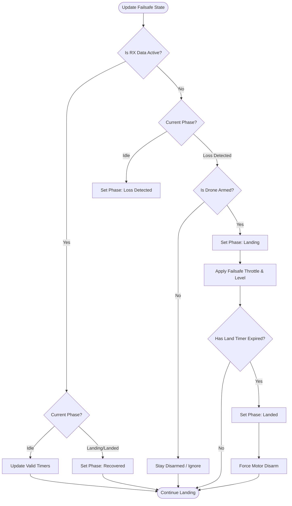

# Failsafe Subsystem (`failsafe.cpp`)

## Overview
The Failsafe module acts as an autonomous safety net. It runs continuously to monitor the health of the RC link. If the receiver loses signal or outputs invalid pulse data, the Failsafe overrides user inputs and dictates exactly how the drone behaves (e.g., level out, slowly descend, then cut motors).

## Source Files
- **Failsafe Core Logic**: `src/main/flight/failsafe.cpp`, `src/main/flight/failsafe.h`
- **RC Monitoring Hook**: `src/main/rx/rx.cpp`
- **Mixer Hook**: `src/main/flight/mixer.cpp`

## Key Data Structures
- `failsafeState_t`: Tracks the current state machine (`FAILSAFE_IDLE`, `FAILSAFE_RX_LOSS_DETECTED`, `FAILSAFE_LANDING`, `FAILSAFE_LANDED`).
- `failsafeConfig()->failsafe_delay`: The required time (e.g., 10 deciseconds) of continuous signal loss before triggering the landing sequence.
- `rcCommand[THROTTLE]`: Overwritten during a failsafe landing to `failsafeConfig()->failsafe_throttle`.

## Primary Functions
- `failsafeUpdateState()`: Polled continuously by the main loop. It checks the `rxData` validity timestamps and transitions the state machine if the signal timeout is exceeded.
- `failsafeApplyControlInput()`: If failsafe is actively landing, this function intercepts the PID pipeline. It zeroes out user Pitch/Roll (forcing the drone to auto-level) and applies a pre-configured low throttle value to descend.
- `mwDisarm()`: Called to instantly stop the motors once the `FAILSAFE_LANDED` timer expires or if the drone wasn't armed to begin with.

## Data Flow & Boundaries
- **Detection Delays**: Brief dropouts (< 0.5s) are usually smoothed over and ignored. The `failsafe_delay` boundary must be crossed to transition from `IDLE` to `LOSS_DETECTED`.
- **Landing Timer**: The `failsafe_off_delay` specifies how long the drone is allowed to execute its auto-level descent (e.g., 15 seconds) before it forcefully disarms to prevent burning motors on the ground.
- **Override Strictness**: When `failsafeApplyControlInput()` is active, the User API (`PlutoPilot`) and Pilot inputs are completely ignored. The Failsafe dictates the `rcCommand` struct exclusively.

