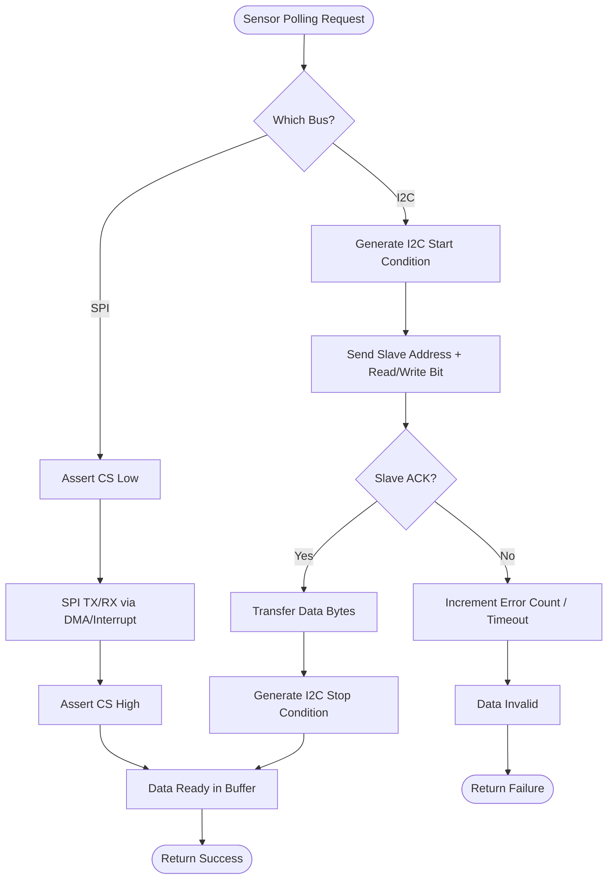

# Hardware Bus Pipeline (I2C & SPI)

## Overview
The Hardware Bus abstraction layer acts as the physical communication bridge between the STM32F3 microcontroller and the onboard peripherals (IMUs, Barometers, Magnetometers, Time-of-Flight sensors). The pipeline is optimized to use DMA (Direct Memory Access) and interrupts where possible to avoid blocking the high-frequency PID control loop.

## Source Files
- **I2C Drivers**: `src/main/drivers/bus_i2c.h`, `src/main/drivers/bus_i2c_stm32f30x.c`, `src/main/drivers/bus_i2c_soft.cpp`
- **SPI Drivers**: `src/main/drivers/bus_spi.h`, `src/main/drivers/bus_spi.c`
- **Peripheral Setup**: `src/main/drivers/system_stm32f30x.c`

## Key Data Structures
- `i2cDevice_t`: Enumerator representing I2C1, I2C2 buses.
- `spiDevice_t`: Enumerator representing SPI1, SPI2, SPI3 buses.
- `i2cError_e`: Error tracking for NACK, Timeout, or Bus Collisions.

## Primary Functions
- `i2cInit()` / `spiInit()`: Configures the GPIO alternate functions, clock speeds, and DMA channels for the respective buses.
- `i2cRead()` / `i2cWrite()`: Standard blocking/non-blocking I2C transactions. Fast I2C (400kHz) is enforced for sensors.
- `spiTransfer()`: Handles synchronous data exchange over SPI. Required for high-speed MPU/ICM IMU gyro data polling (up to 8MHz).

## Data Flow & Boundaries
- **I2C Constraints**: The I2C bus is notoriously susceptible to noise and hardware lockups. The firmware implements a strict timeout and recovery mechanism (bus reset) if an `I2C_Timeout` occurs.
- **SPI Constraints**: SPI is the preferred interface for IMUs due to its high throughput. The maximum clock speed is bounded by the specific peripheral (e.g., MPU6000 limits SPI to 1MHz for registers, 20MHz for data).

