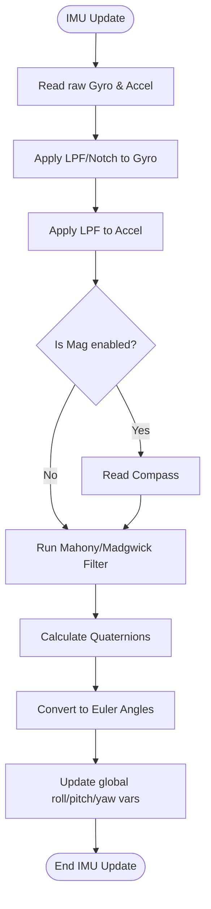

# IMU & Sensor Fusion Pipeline (`imu.cpp`)

## Overview
This subsystem reads raw physical forces from the sensors, removes high-frequency vibration noise, and mathematically fuses the data to calculate the drone's precise 3D orientation in space (Attitude).

## Source Files
- **Sensor Fusion Logic**: `src/main/flight/imu.cpp`, `src/main/flight/imu.h`
- **Sensor Fetching**: `src/main/sensors/acceleration.cpp`, `src/main/sensors/gyro.cpp`, `src/main/sensors/compass.cpp`
- **Filtering**: `src/main/flight/filter.cpp`

## Key Data Structures
- `gyroADC[3]` / `accADC[3]`: The raw, unscaled ADC readings from the IMU hardware.
- `imu.attitude.values`: A struct holding the computed `roll`, `pitch`, and `yaw` in tenths of a degree (e.g., `450` = 45.0 degrees).
- `q0, q1, q2, q3`: The internal quaternion representations of the drone's orientation before Euler conversion.

## Primary Functions
- `imuUpdate()`: The high-frequency master function. Calls sensor updates, applies filters, and runs the Mahony complementary filter.
- `gyroUpdate()` / `accUpdate()`: Polls the SPI/I2C buses, applies board alignment rotations, and scales the ADC data to standard units (`deg/s` and `g`).
- `imuMahonyAHRSupdate()`: The core fusion algorithm mixing Gyro (fast, but drifts) with Accel/Mag (noisy, but absolute) to track the gravity vector.

## Data Flow & Boundaries
- **Coordinate System**: The firmware enforces a Right-Handed coordinate system. `X` is Roll, `Y` is Pitch, `Z` is Yaw.
- **Update Rates**: The Gyro is typically polled at 1kHz to 8kHz, while the Accelerometer is polled at 1kHz. Magnetometer (if enabled) is much slower (10-50Hz).
- **Filtering Boundaries**: Raw gyro data is heavily filtered. A software Low Pass Filter (LPF) and potentially dynamic Notch filters strip out motor resonance (typically 100Hz - 400Hz).

