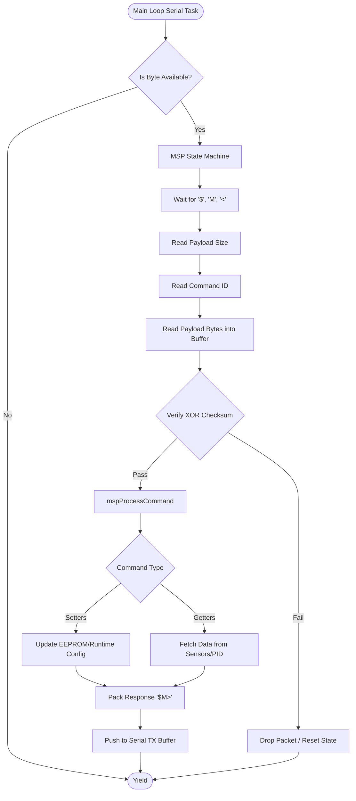

# MSP Communications Pipeline & USB VCP

## Overview
The MultiWii Serial Protocol (MSP) is the primary API via which the Ground Control Station (GCS) or external companions communicate with the MagisV2 firmware. It handles telemetry requests, parameter configuration, motor testing, and live sensor data streaming over UART or Virtual COM Port (USB VCP).

## Source Files
- **MSP Protocol Logic**: `src/main/io/serial_msp.cpp`, `src/main/io/serial_msp.h`
- **UART / VCP Drivers**: `src/main/drivers/serial.cpp`, `src/main/drivers/serial_usb_vcp.c`
- **Port Management**: `src/main/io/serial.cpp`

## Key Data Structures
- `serialPort_t`: A struct holding pointers to UART/VCP read/write functions and RX/TX buffer states.
- `mspPort_t`: Tracks the state machine of an active MSP connection (e.g., waiting for header, reading payload, checksum validation).
- `mspHeader_t`: Standard MSP frame structure (`$M<`, direction, size, command ID).

## Primary Functions
- `mspProcess()`: The core state machine called continuously in the main loop to process incoming bytes from the active serial ports.
- `mspProcessCommand()`: Acts on a fully validated MSP packet. Uses a massive `switch(cmd)` statement to branch to handlers like `MSP_SET_PID`, `MSP_RC`, `MSP_MOTOR`.
- `serialWrite()`: Sends the constructed MSP response packet (or telemetry data) back down the wire.

## Data Flow & Boundaries
- **Baud Rates**: UART connections typically default to 115200 baud. USB VCP ignores baud rate constraints entirely.
- **Buffer Limits**: The MSP payload size is strictly bounded (historically ~255 bytes max per frame, though some extensions support larger). Buffer overflows must be prevented to avoid heap corruption.
- **State Machine**: The MSP parser reads one byte at a time per loop iteration to avoid blocking the high-frequency control loops.

