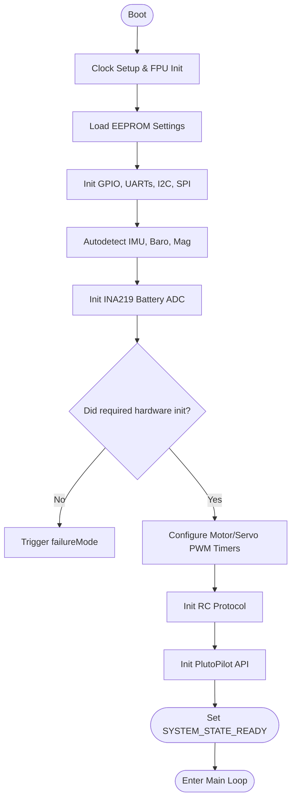

# Main Initialization (`init()` in `main.cpp`)

## Overview
When the STM32F3 MCU boots, `main()` immediately calls `init()`. This phase is critical for establishing the operational baseline of the flight controller: setting up hardware peripherals (clocks, DMA, timers), allocating necessary RAM, and probing the I2C/SPI buses to check sensor health before permitting flight.

## Source Files
- **Bootloader & Main Entry**: `src/main/main.cpp`
- **Hardware Bootstrap**: `src/main/drivers/system_stm32f30x.c`
- **EEPROM Storage**: `src/main/config/config.cpp`

## Key Data Structures
- `masterConfig`: The globally loaded configuration structure read from EEPROM. Contains settings for sensors, PID tuning, and UART configurations.
- `hw_timer_t`: Timers instantiated for PWM/Motor output and system scheduling.

## Primary Functions
- `init()`: The master bootstrapping sequence.
- `systemInit()`: Initializes the ARM Cortex-M4 FPU, sets the core clock to 72MHz, and enables the SysTick timer for `millis()` and `micros()` timing.
- `readEEPROM()`: Loads user configurations. If the checksum fails or the firmware version differs, it executes a `resetEEPROM()` to load safe defaults.
- `sensorsAutodetect()`: Probes the SPI/I2C buses sequentially. For example, it checks the MPU6000 signature register. If it fails, it halts boot sequence via `failureMode()`.

## Data Flow & Boundaries
- **Blocking Boot**: The `init()` sequence is strictly synchronous. The MCU cannot proceed to `loop()` until every peripheral has reported a successful initialization.
- **I2C Bus Lockups**: A common initialization failure is a locked I2C bus. The boot sequence often toggles the SCL/SDA pins manually via GPIO to flush stalled sensor lines before initializing the hardware I2C peripheral.
- **Completion Check**: Once `init()` finishes successfully, the global state is switched to `SYSTEM_STATE_READY`, allowing the infinite `mw.cpp` `loop()` to begin fetching sensor data.

