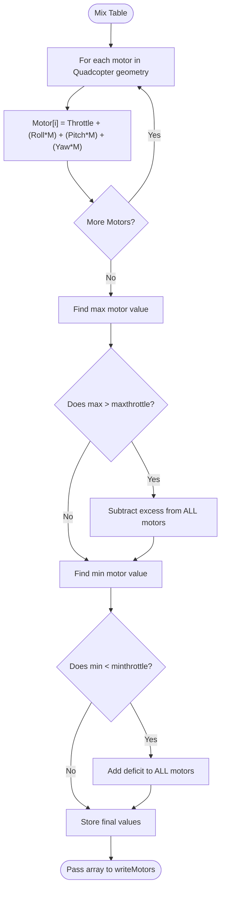

# Mixer Pipeline (`mixer.cpp`)

## Overview
The Mixer translates the mathematical corrections requested by the PID controller (`axisPID`) and the master `Throttle` into individual speeds for each physical motor. This pipeline strictly enforces a Quadcopter multi-rotor mixing geometry, calculating how much each specific motor must speed up or slow down to achieve the requested Roll, Pitch, or Yaw maneuver.

## Source Files
- **Core Logic**: `src/main/flight/mixer.cpp`, `src/main/flight/mixer.h`
- **Output Driver**: `src/main/drivers/pwm_output.cpp`

## Key Data Structures
- `motor[MAX_SUPPORTED_MOTORS]`: The output array holding the final calculated PWM values (typically 1000-2000) for each ESC.
- `axisPID[3]`: The required corrections for Roll, Pitch, and Yaw.
- `rcCommand[THROTTLE]`: The base throttle commanded by the user.
- `motorMixer_t`: The matrix defining the Quadcopter geometry multipliers (e.g., Motor 1 gets +Roll, +Pitch, -Yaw).

## Primary Functions
- `mixTable()`: Iterates over the Quadcopter geometry matrix, multiplying `axisPID` by the geometric weight and adding it to the base throttle.
- `writeMotors()`: Takes the final `motor[]` array and pushes it to the hardware PWM timers or DSHOT driver.
- `stopMotors()`: Failsafe override to instantly set `motor[]` values to `mincommand` (motors off).

## Data Flow & Boundaries
- **Motor Clipping**: The absolute maximum value any motor can receive is `maxthrottle` (default 2000). The absolute minimum while armed is `minthrottle` (default ~1070).
- **AirMode / Mix Saturation**: If a maneuver requires a motor to spin at 2100 (which is physically impossible), `mixTable()` calculates the excess (+100) and subtracts it from all other motors. This preserves the *ratio* of the maneuver, sacrificing overall altitude instead of stability.
- **Disarm State**: If the drone is disarmed, `mixTable()` is bypassed entirely and all outputs are locked to `mincommand` (1000), physically preventing ESCs from spinning.

