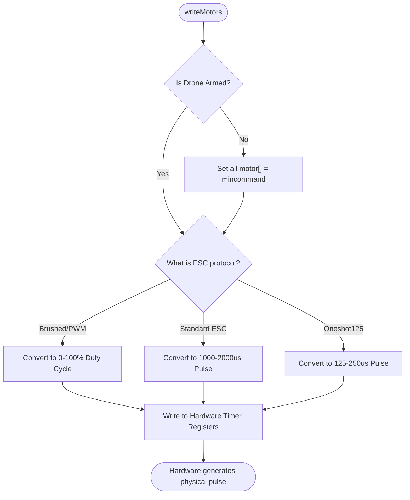

# Motor Control & Hardware Output (`motor.cpp` / `pwm_output.cpp`)

## Overview
Takes the calculated integer values from the mixer and translates them into physical electrical signals that the ESCs or brushed motors can understand. It interfaces directly with the STM32 Hardware Timers to generate precision PWM or digital (DSHOT/Oneshot) pulses.

## Source Files
- **High-Level Motor Logic**: `src/main/flight/motor.cpp`, `src/main/flight/motor.h`
- **Hardware Timer Mappings**: `src/main/drivers/pwm_mapping.cpp`
- **PWM/Output Driver**: `src/main/drivers/pwm_output.cpp`, `src/main/drivers/timer_stm32f30x.c`

## Key Data Structures
- `motor[MAX_SUPPORTED_MOTORS]`: The source array populated by the Mixer (values 1000-2000).
- `timerHardware_t`: Struct mapping a physical CPU pin to a specific Timer and Channel (e.g., `PA8 -> TIM1_CH1`).
- `pwmConfig_t`: Contains the configured ESC protocol (`PWM`, `ONESHOT125`, `BRUSHED`) and timer frequencies.

## Primary Functions
- `writeMotors()`: The master function. Iterates through the active motors and pushes the `motor[]` values to the hardware registers.
- `pwmWriteMotor()`: The low-level driver call that actually writes to the `TIMx->CCR` (Capture/Compare Register) to set the duty cycle of the pulse.
- `pwmInit()`: Configures the GPIO pins as Alternate Function (AF) timer outputs during initialization.

## Data Flow & Boundaries
- **Brushed Protocol**: Translates the 1000-2000 mixer range into a 0-100% duty cycle at a high frequency (e.g., 8kHz-32kHz) for direct MOSFET driving.
- **Standard PWM ESC**: Outputs a 1000us to 2000us pulse at 400Hz.
- **Arming State Enforcement**: If the global `ARMED` flag is false, `writeMotors()` forces all channels to output `mincommand` (1000us or 0% duty), physically guaranteeing the motors cannot spin regardless of what the Mixer calculates.

