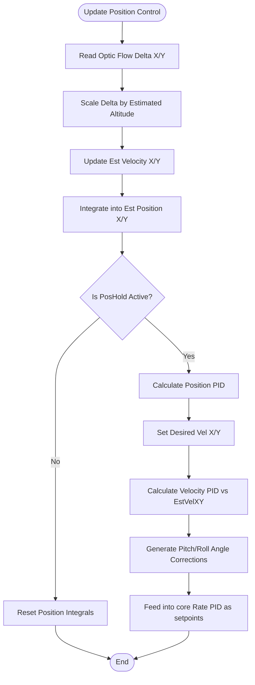

# Optic Flow & Position Control (`opticflow.cpp` / `posControl.cpp`)

## Overview
Uses a downward-facing camera sensor (e.g., PAW3903) to detect ground movement and lock the drone's X/Y position in the air. This requires fusing the optical displacement data with the estimated altitude (to determine true physical velocity) and cascading through Velocity and Position PID loops to output Pitch and Roll commands.

## Source Files
- **Optic Flow Driver**: `src/main/drivers/opticflow_paw3903.cpp`, `src/main/drivers/paw3903_opticflow.cpp`
- **Flight Logic Integration**: `src/main/flight/opticflow.cpp`
- **Position Controller**: `src/main/flight/posControl.cpp`, `src/main/flight/navigation.cpp`

## Key Data Structures
- `opticFlow`: A struct containing the raw `deltaX` and `deltaY` pixel shifts reported by the sensor via SPI.
- `EstVel[X/Y]`: The computed physical horizontal velocity in cm/s.
- `posControl.target[X/Y]`: The locked position coordinate (internally integrated) that the PID loop tries to maintain.
- `rcCommand[PITCH/ROLL]`: The outputs of the Position controller, fed directly into the core stabilizing PID loop.

## Primary Functions
- `opticflowUpdate()`: Polls the PAW3903 sensor over SPI, reading the motion registers and surface quality metrics.
- `posControlUpdate()`: The cascading PID controller. It first computes Position Error to generate a Target Velocity. It then computes Velocity Error to generate Target Angles (Pitch/Roll).
- `applyPosHold()`: Overrides the user's Pitch/Roll stick inputs when the PosHold mode is engaged.

## Data Flow & Boundaries
- **Altitude Dependency**: Optic flow requires the `EstAlt` variable. A 10-pixel shift at 10cm altitude is a tiny physical movement, but at 200cm altitude, it's a massive physical movement.
- **Surface Quality**: If the sensor cannot see texture (e.g., flying over plain white paper or in low light), it sets a low `surfaceQuality` flag, causing the position controller to gracefully degrade to manual mode to prevent erratic flyaways.
- **Cascading PID Loop**: 
  1. Position Error (cm) * Pos_P -> Target Velocity (cm/s).
  2. Velocity Error (cm/s) * Vel_PID -> Angle Correction (degrees).

