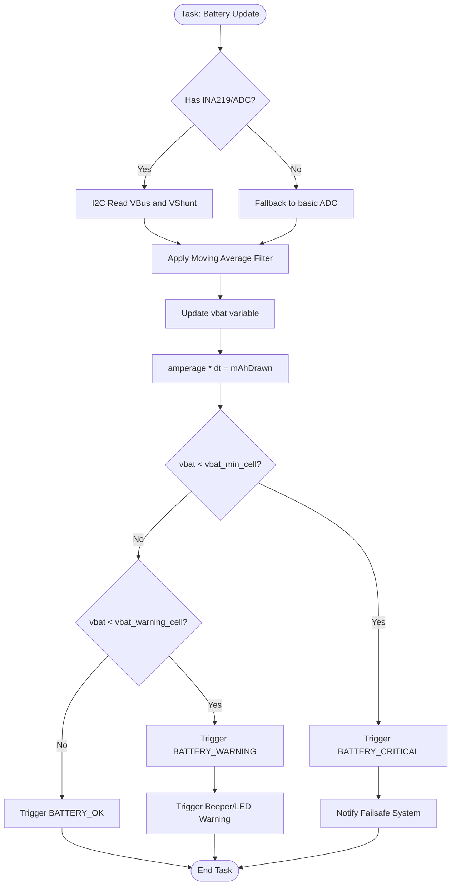

# Battery Management System (BMS) & Power Pipeline

## Overview
The Battery Management System (BMS) continuously monitors the drone's power state. It is responsible for reading live voltage and current, calculating the total mAh drawn from the battery, and triggering capacity-based warnings or low-power failsafe landing sequences to prevent deep discharge or mid-air power loss.

## Source Files
- **Hardware Driver**: `src/main/drivers/ina219.cpp`, `src/main/drivers/ina219.h`
- **Battery Sensor Logic**: `src/main/sensors/battery.cpp`, `src/main/sensors/battery.h`
- **BMS API Layer**: `src/main/API-Src/BMS.cpp`, `src/main/API/BMS.h`

## Key Data Structures
- `vbat`: Live battery voltage in 0.1V steps (e.g., `42` = 4.2V).
- `amperage`: Live current draw in centi-amps (cA).
- `mAhDrawn`: Accumulated battery capacity drawn.
- `batteryState`: Enumeration tracking the battery health (`BATTERY_OK`, `BATTERY_WARNING`, `BATTERY_CRITICAL`).

## Primary Functions
- `ina219Init()`: Initializes the INA219 sensor over I2C and configures the shunt resistor calibration.
- `batteryUpdate()`: Periodically called in the main loop to poll the ADC/INA219, smooth the readings via a moving average filter, and integrate amperage to calculate `mAhDrawn`.
- `updateBatteryStatus()`: Compares `vbat` against configured minimums (`vbat_min_cell_voltage`) and sets `batteryState`.

## Data Flow & Boundaries
- **Voltage Range**: Supported up to 2S or 3S depending on the hardware divider, commonly tracking 3.5V to 4.2V per cell.
- **Current Range**: The INA219 shunt calibration typically supports up to 3.2A or 32A depending on the onboard shunt resistor.
- **Filtering**: A software Low-Pass Filter (LPF) or moving average is strictly applied to `vbat` to prevent voltage sag from high throttle punches from triggering false critical warnings.

