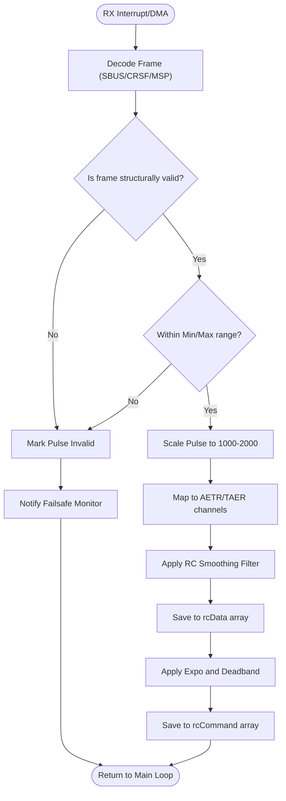

# RC Input Pipeline (`rx.cpp`)

## Overview
The receiver subsystem fetches external control data, validates it, smooths it, and maps it to the internal `rcCommand` array which drives the drone. This subsystem also hooks directly into the Failsafe mechanism if invalid pulses or connection drops are detected.

## Source Files
- **Core Logic**: `src/main/rx/rx.cpp`, `src/main/rx/rx.h`
- **RC Mapping Curves**: `src/main/io/rc_curves.cpp`
- **Protocol Drivers**: `src/main/rx/crsf.c`, `src/main/rx/sbus.c`, `src/main/rx/msp.c`

## Key Data Structures
- `rcData[MAX_SUPPORTED_RC_CHANNEL_COUNT]`: The raw, smoothed pulse width data (scaled to roughly 1000-2000).
- `rcCommand[4]`: The finalized, mapped stick commands for Roll, Pitch, Yaw, and Throttle.
- `rxRuntimeConfig`: Tracks the active RC protocol, channel mapping (e.g., AETR1234), and min/max pulse boundaries.

## Primary Functions
- `computeRC()`: The main entry point called periodically in the loop. It reads the latest frame, applies jitter filtering, and maps it to `rcData`.
- `rxUpdateCheck()`: Polled to verify if a new, valid frame has arrived. If a timeout occurs, it signals `failsafeUpdateState()`.
- `rcCurve()`: Applies Expo and Deadband transformations to `rcData` to populate `rcCommand`.

## Data Flow & Boundaries
- **Raw Pulse Constraints**: Incoming signals are expected between `1000` (min) and `2000` (max) microseconds. Midpoint is exactly `1500`.
- **Invalid Pulses**: If a channel reports `< 885` or `> 2115` (default `rx_min_usec` / `rx_max_usec`), the pulse is marked invalid and failsafe logic may increment.
- **Filtering**: A multi-point moving average filter (`rx_smoothing`) prevents sudden, physically impossible jumps in RC commands from reaching the PID loop.

