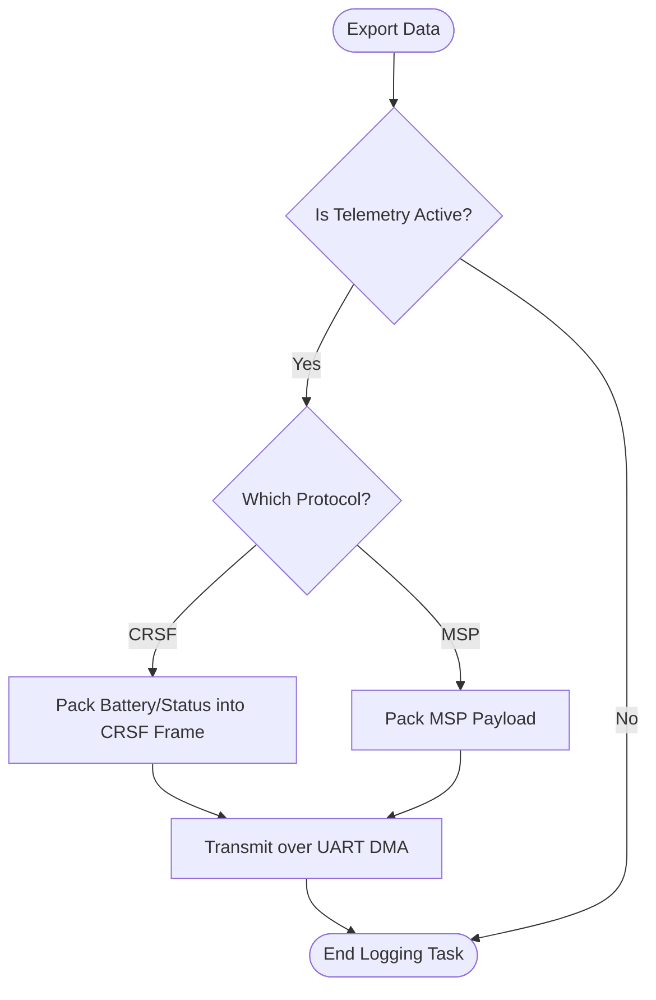

# Telemetry Pipeline (`telemetry.c`)

## Overview
Runs at the end of the loop (or interleaved via the task scheduler) to export live drone data to the outside world. This subsystem handles packing the internal variables (like Voltage, Pitch/Roll angles, and Flight Modes) into specific telemetry protocol frames (like CRSF, SmartPort, or MSP) and dispatching them over the UART DMA.

## Source Files
- **Telemetry Master Task**: `src/main/telemetry/telemetry.c`, `src/main/telemetry/telemetry.h`
- **Protocol Encoders**: `src/main/telemetry/msp.c`, `src/main/telemetry/crsf.c`, `src/main/telemetry/smartport.c`
- **Serial Transmission**: `src/main/io/serial.cpp`

## Key Data Structures
- `telemetryConfig_t`: Runtime configuration defining which UART ports have telemetry enabled and which protocol they should use.
- `crsfPayload_t` / `mspPacket_t`: The byte-aligned structures representing the exact over-the-air frame format.
- Global State Variables: `vbat`, `EstAlt`, `flightModeFlags`, `arm_state`.

## Primary Functions
- `telemetryCheckState()`: Polled periodically to see if a telemetry transmission is due based on the configured scheduling Hz.
- `checkTelemetryState()` / `initTelemetry()`: Sets up the UART ports based on the active protocol (e.g., enabling half-duplex for SmartPort).
- `handleCRSFTelemetry()` / `handleMSPTelemetry()`: The specific encoders that copy global state variables into the payload struct and calculate the checksum.

## Data Flow & Boundaries
- **Task Scheduling**: Telemetry is inherently slow compared to the 1kHz PID loop. Telemetry tasks are strictly rate-limited (e.g., 10Hz or 50Hz) to prevent CPU starvation.
- **Non-Blocking TX**: Once the frame is packed, it is passed to `serialWrite()`. The actual transmission of the bits over the wire is handled asynchronously by the STM32 DMA controller, ensuring the CPU returns to the flight loop immediately.
- **Protocol Limitations**: CRSF telemetry is extremely fast and compact, whereas legacy protocols like HoTT or FrSky require complex polling mechanisms and byte stuffing.

