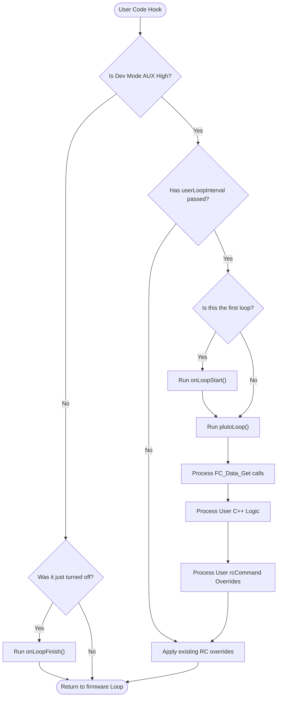

# User Space API (`PlutoPilot.cpp`)

## Overview
The `PlutoPilot` developer sandbox allows custom user C++ code to intercept the main flight loop. Developers can securely override controls, read live sensor variables, and trigger external LEDs or displays—all without breaking the real-time safety and timing of the core PID loops.

## Source Files
- **Sandbox Definition**: `PlutoPilot.cpp`, `PlutoPilot.h` (Root level developer files)
- **API Interfaces**: `src/main/API-Src/*` (e.g., `FC-Control-Command.cpp`, `FC-Data-Sensors.cpp`)
- **API Headers**: `src/main/API/*` (e.g., `FC-Control.h`, `Peripherals.h`)

## Key Data Structures
- `rcCommand[4]`: The user API often overwrites this array (Pitch, Roll, Yaw, Throttle) to fly the drone autonomously.
- `Flight_State_e`: Enumeration that the API uses to determine if the drone is Armed, in Failsafe, or Grounded.
- `Control_Command_t`: The wrapper structure the API uses to push new commands (like `TakeOff`, `Land`, or `Flip`) to the flight controller queue.

## Primary Functions
- `plutoInit()`: Called once during boot by `init()`. Used by the developer to configure GPIOs, external sensors, or set up API timers.
- `plutoLoop()`: The continuously executing user function. Called directly by the main control loop.
- `Command.set(CommandType)`: Exposed API function used inside `plutoLoop()` to trigger complex maneuvers or state changes natively.
- `Estimate.get(State)`: Exposed API function to pull live `EstAlt`, `EstVel`, or `Pitch/Roll` angles safely.

## Data Flow & Boundaries
- **Time Slice Strictness**: Because `plutoLoop()` executes within the high-frequency control loop, user code *must not block*. The use of `delay()` is explicitly forbidden, as it would cause the drone to instantly crash by halting the PID calculations.
- **Override Priority**: If the Failsafe mechanism activates, the firmware explicitly ignores `rcCommand` overrides originating from `plutoLoop()`. Failsafe takes ultimate precedence over the API.
- **Rate Limiting**: To prevent API logic from running unnecessarily fast (e.g., polling an ultrasonic sensor 1000 times a second), developers use the `Monitor.timer` API to schedule tasks sequentially.

