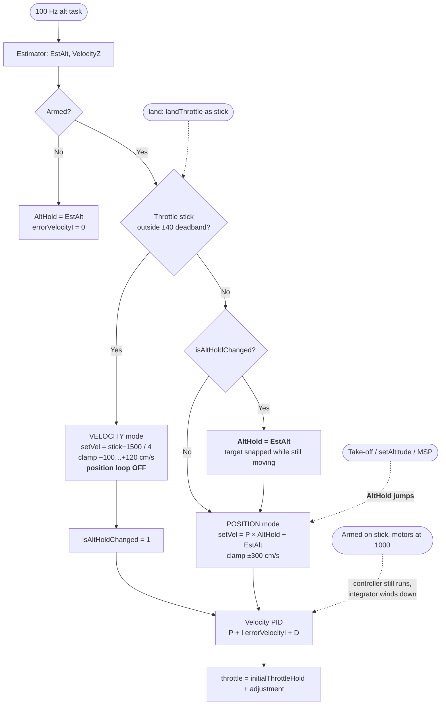
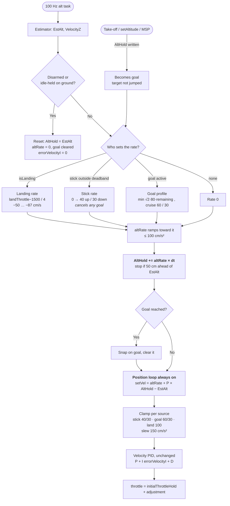

# Changes

[README](README.md) · [CHANGES](CHANGES.md) · [TESTING](TESTING.md)

All changes are in [altitudehold.cpp](../../../../src/main/flight/altitudehold.cpp).

## Constants and state

These are defined next to the hover-trim offload constants.

| Name | Value | Meaning |
|---|---|---|
| `ALT_MAX_CLIMB_CMS` | 40 | Full stick up |
| `ALT_MAX_DESCENT_CMS` | 30 | Full stick down |
| `ALT_CMD_MAX_CLIMB_CMS` | 60 | Cruise up to a commanded goal (take-off) |
| `ALT_CMD_MAX_DESCENT_CMS` | 30 | Cruise down to a commanded goal |
| `ALT_GOAL_DECEL_CMSS` | 80 | Braking into a goal. Kept below the ramp so the ramp can follow it |
| `ALT_STICK_FULL_TRAVEL` | 500 | Stick counts from centre to end |
| `ALT_STICK_ACCEL_CMSS` | 100 | Ramp of the profile rate |
| `ALT_VEL_ACCEL_CMSS` | 150 | Slew of the final velocity setpoint |
| `ALT_TARGET_LEASH_CM` | 50 | The target stops advancing this far from `EstAlt` |
| `ALT_LAND_MAX_DESCENT_CMS` | 100 | Descent clamp while `isLanding` |

The new file-static state is `altRate` (ramped profile rate), `altVelTarget`
(slewed velocity setpoint), `altTarget` (float copy of `AltHold`, so fractions
of a centimetre per 10 ms tick are not lost), `altGoal` / `altGoalActive`
(commanded altitude being travelled to) and `altHoldGroundIdle`.
`resetAltSetpoint ( )` clears the ramp, the slew and the goal, and pins
`AltHold` to `EstAlt`.

## `applyMultirotorAltHold ( )` (main loop)

- Default (`alt_hold_fast_change = 0`) branch: the stick now only sets
  `setVelocity`, which scales linearly from 0 at the dead-zone edge to the
  maximum at full stick. It no longer switches the controller mode or snaps
  `AltHold` on centring. The `velocityControl` flag is removed.
- While `isLanding`, `setVelocity = constrain ( ( landThrottle - 1500 ) / 4,
  -ALT_LAND_MAX_DESCENT_CMS, 0 )`, which is the pre-shaping landing profile.
  The 100 Hz clamp also uses `ALT_LAND_MAX_DESCENT_CMS` (100) for descent while
  landing. See README open item 2.
- `altHoldGroundIdle` is set while `isThrottleStickArmed` holds the motors at
  1000.
- The `alt_hold_fast_change = 1` branch is unchanged.

## `offloadHoverTrim ( )`

The trim offload now takes no argument. It runs only when armed, not idle-held,
with the stick in the dead zone and the stick ramp fully back to 0.

## `updateAltHoldState ( )`

- Mode entry calls `resetAltSetpoint ( )`.
- Mode exit clears `setVelocity` and `altHoldGroundIdle`, because
  `applyAltHold ( )` stops running.

## `calculateAltHoldThrottleAdjustment ( )` (100 Hz)

The function takes a new `ctrlDt` argument. Both callers pass it:
`apmCalculateEstimatedAltitude ( )` and the legacy `calculateEstimatedAltitude ( )`.
(It was named `dt` at first, but that shadowed a global.)

1. When disarmed or idle-held, the setpoint and integrator are reset and it
   returns 0.
2. An external write to `AltHold` (`setAltitude ( )`, MSP, take-off) becomes
   `altGoal`, and `altTarget` stays where it is. A non-zero `setVelocity` (stick
   or landing) cancels the goal.
3. The profile rate is `setVelocity`. With a goal active, it is
   `±min ( sqrt ( 2 · 80 · remaining ), cruise )` instead: the fastest rate that
   can still brake to a stop on the goal. `altRate` ramps toward it at
   100 cm/s².
4. The target moves by `altRate · ctrlDt`, and does not advance beyond the
   leash from `EstAlt` in the direction of travel. Within 1 cm of the goal,
   with the rate braked, it snaps onto the goal and the goal clears.
5. The velocity demand is `altRate + P_ALT · error`. The clamp depends on the
   mode: stick [-30, +40], goal [-30, +60], landing descent -100. The demand is
   slewed at 150 cm/s². This replaces the old ±300 cm/s clamp.
6. The velocity PID is unchanged.

## Build

All targets at FW 3.8.0: PRIMUS_X2_v1 98.4 KB / 14.8 KB, PRIMUSX2 98.9 / 15.0, PRIMUS_V5 98.4 / 14.8. The strict flags give no new
warnings.

## Before / after

### The difference in one sentence

The legacy code **switched between two controllers** depending on the stick. The
new code **always runs the same controller and only moves its target**.

- **Legacy:** in the dead zone, a position loop held `AltHold`. Outside it, the
  position loop was switched off and the stick commanded a raw climb rate,
  `( stick - 1500 ) / 4`. On returning to the dead zone, `AltHold` was set to
  wherever `EstAlt` happened to be. Commands (take-off, `setAltitude ( )`, MSP)
  wrote a new `AltHold` in one step.
- **New:** the position loop is always on. The stick, a command or landing
  only decide **how fast the target slides** (`altRate`). The target moves by
  `altRate · dt` every tick, and the same rate is fed forward, so the drone is
  told both where to be and how fast to get there.

### What each approach does in flight

| | Legacy | New |
|---|---|---|
| Leaving the dead zone | Demand steps 0 to 10 cm/s | Rate builds from 0 |
| Changing speed | Instant, any size | Ramped at 100 cm/s² |
| Full stick | +120 / -100 cm/s | +40 / -30 cm/s |
| Centring the stick | Target snaps to `EstAlt` while still moving, so it overshoots and comes back | Rate ramps down and the target coasts to a stop, no overshoot |
| Disturbance while climbing on the stick | Only speed is controlled; lost height is not recovered until the stick is centred | Position loop tracks the moving target, so lost height is recovered during the climb |
| Take-off / `setAltitude ( )` / MSP | Target steps; the P = 1 loop slows as the gap closes, 120 cm takes about 4.3 s | Trapezoid profile: cruise 60 cm/s, brake at 80 cm/s², about 2.7 s, stops on the goal |
| Landing | Stick formula, -50 to -87 cm/s | Same rates, through its own path |
| Armed on the stick, waiting on the ground | Integrator winds down, sluggish take-off | Controller held in reset, clean take-off |
| Code | `velocityControl` flag, two branches | One path; only the rate source differs |

### Why the new approach is better

1. **No mode switch, so no switching transients.** Every jump the legacy code
   produced came from swapping controllers: the speed step at the dead-zone
   edge, and the target snapping to a still-moving `EstAlt` on centring (the
   overshoot). With one path there is nothing to swap.
2. **Feed-forward removes the lag.** A pure position loop with P = 1 needs a
   60 cm gap to demand 60 cm/s, so the drone always trails the target and
   crawls at the end of every move. Feeding the planned rate forward makes the
   position error only a small correction, so the drone keeps up and stops
   where the target stops.
3. **Height stays controlled during stick input.** The legacy velocity mode had
   no idea where the drone should be. A gust or a sagging battery during a
   climb went uncorrected until the pilot let go. The new target always
   defines where the drone should be, so the loop corrects all the time.
4. **Every input is bounded the same way.** Stick, commands and landing all go
   through one rate ramp and one clamp. None of them can ask for a step change
   in speed; the legacy position loop allowed up to ±300 cm/s at once.
5. **Predictable behaviour for pilots and user code.** Stick position maps to a
   fixed speed, and a commanded altitude is reached in a known time with no
   overshoot. The same model is used by ArduPilot (`set_pos_target_z_from_climb_rate`),
   PX4 and DJI, so it matches what pilots expect.
6. **The ground case is handled.** Holding the controller in reset while the
   drone cannot move stops the integrator winding down before take-off, which
   the legacy structure had no place for.

### What it costs, and what is still open

- **More constants to tune:** ramp, slew, leash, cruise and brake rates. These
  are first values from one airframe.
- **Landing is a special case.** It must bypass the stick limits: at slow
  descent rates, barometer drift in ground effect masked the descent and
  touchdown was never detected (README open item 2).
- **No general landed detector yet.** The ground reset only covers the
  stick-armed idle hold.
- **The goal-profile take-off has not been flown yet.**

### Flow

**Legacy:** the stick chose which controller ran. The target only changed by
snapping or jumping.

**New:** one path. Every input only decides how fast the target slides, and the
position loop always tracks it.

Unchanged: the estimator, the velocity PID ( P 120 / I 45 / D 1 ), the throttle
output, the hover-trim offload and the `alt_hold_fast_change = 1` branch.
