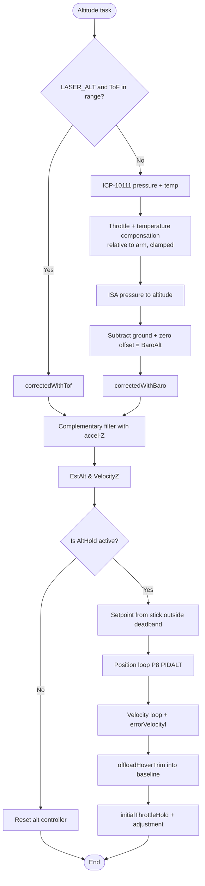

# Altitude Hold: Staged Pipeline Update

[README](README.md) · [INVESTIGATION](INVESTIGATION.md) · [CHANGES](CHANGES.md) · [TESTING](TESTING.md) · [PIPELINE_UPDATE](PIPELINE_UPDATE.md)

> **Applied at commit ( FW 3.7.0, 18 Sep 2026 ).** Kept as the record of what was promoted. This is how [Altitude_Hold_Estimator.md](../../fw-architecture-pipeline/subsystems/Altitude_Hold_Estimator.md)
> should read once the altitude-hold work is committed. At commit, replace that
> file with everything below the line. Until then the pipeline doc describes the
> committed firmware.
>
> Besides adding the barometer chain, this corrects errors already in the live
> doc: it names `updateZVelocity()`, `updateZPosition()` and
> `calculateBaseThrottle()`, which do not exist, and places the Z estimate in
> `posEstimate.cpp` instead of `altitudehold.cpp`.

---

# Altitude Hold & Estimator (`altitudehold.cpp`)

## Overview
Fuses barometric pressure (and, when `LASER_ALT` is defined, laser Time-of-Flight) with the accelerometer's Z-axis to estimate altitude and vertical velocity. When `ALT_HOLD` mode is active, it takes over the throttle channel to hold or smoothly change height.

## Source Files
- **Altitude estimator and controller**: `src/main/flight/altitudehold.cpp`, `src/main/flight/altitudehold.h`
- **Barometer chain**: `src/main/sensors/barometer.cpp` (conversion, zero, compensation), `src/main/drivers/barometer_icp10111.cpp` (ICP-10111 driver)
- **Laser**: `src/main/drivers/ranging_vl53l0x.cpp` (only used by the estimator with `LASER_ALT`)
- **XY position** (not altitude): `src/main/flight/posEstimate.cpp`, `src/main/flight/posControl.cpp`

## Key Data Structures
- `EstAlt`: estimated altitude in cm. What the controller and `limitAltitude()` use.
- `VelocityZ`: estimated vertical velocity in cm/s.
- `BaroAlt`: compensated barometric altitude in cm, the measurement the estimator is corrected towards. Noisier than `EstAlt` by design.
- `AltHold`: the altitude setpoint.
- `initialThrottleHold`: the hover-throttle baseline. `errorVelocityI` (the only alt-hold integrator) carries the residual trim.

## Primary Functions
- `apmCalculateEstimatedAltitude()`: runs the third-order complementary filter each altitude task, integrating accel-Z and correcting towards the height measurement.
- `checkBaro()` → `correctedWithBaro()`: barometer path (no `LASER_ALT`). Time constant `_time_constant_z` is 2 s, or 5 s above 30° of tilt.
- `checkReading()` → `correctedWithTof()`: with `LASER_ALT`, laser below 200 cm (hard switch, no blend), barometer above, with `baro_offset` aligning the two at handover.
- `applyAltHold()`: outer position loop (`P8[PIDALT]`, 128 = unity) feeding an inner velocity loop; output added to `initialThrottleHold`.
- `offloadHoverTrim()`: while settled, moves hover trim from `errorVelocityI` into `initialThrottleHold` one count per 20 ms, keeping the integrator's range free.
- `limitAltitude()`: altitude ceiling at `max_altitude - ALT_CEILING_MARGIN_CM` (25 cm).

## Barometer chain (`sensors/barometer.cpp`)

The ICP-10111 does not report the true static pressure of the air: rotor inflow and the board's heating both shift it. The chain from raw reading to `BaroAlt`:

1. **Driver** (`barometer_icp10111.cpp`): `NORMAL` measurement mode (~7 ms conversion). Die temperature is low-pass filtered (`TEMP_LPF_ALPHA`) and feeds the sensor's own compensation polynomial.
2. **Compensation** (`baroCompensationPa()`): adds back pressure lost to throttle and temperature, relative to the values latched at the arm instant, so it is zero on the first armed sample:
   - `BARO_COMP_THROTTLE_PA_PER_COUNT` = 0.0086 Pa per `rcCommand[THROTTLE]` count
   - `BARO_COMP_TEMP_PA_PER_DEGC` = 2.1 Pa per °C of die temperature (measured −2.17 to −2.42 on PRIMUS_V5)
   - total clamped to ±`BARO_COMP_LIMIT_PA` (25 Pa, ~2 m)
3. **Conversion** (`pressureToAltitude()`): ISA standard atmosphere at a fixed 288.15 K. Deliberately temperature-free, so the scale does not depend on how warm the board is. About 8.3 cm per Pa near sea level.
4. **Zero** (`baroUpdateZero()`): while disarmed, an IIR tracks the reading so warm-up before takeoff is absorbed; frozen on arm. Applied as an offset (`getBaroZeroOffset()`).

`BaroAlt = altitude(pressure + compensation) − ground altitude − zero offset`.

Rules that keep this working:
- **Never re-zero in flight.** `baroResetGroundLevel()` is only allowed before the throttle has been raised since arming (`throttleRaisedSinceArm` in `mw.cpp`).
- **Keep estimator lag low.** A slow estimate lags high during a descent and commands more descent; adding filtering to `BaroAlt` trades noise for exactly this.
- **Coefficients are per airframe.** The throttle term depends on where the FC sits relative to the rotors. Re-measure on a new frame from a log of `degC`, `PaI` and laser height over a 3+ minute hover.

## Data Flow & Boundaries
- **Stick deadband**: in `ALT_HOLD`, `alt_hold_deadband` (40) is applied to the throttle stick. Inside it the drone holds altitude; beyond it, climb/descend at a rate set by stick deflection. There is no deadband on the position error.
- **ToF vs Baro**: with `LASER_ALT`, the VL53L0X (200 cm) or VL53L1X (350 cm) replaces the barometer below its range. Without it, the estimator is barometer and accel-Z only. `LASER_TOF` alone reads the laser for logging and does not affect altitude.

