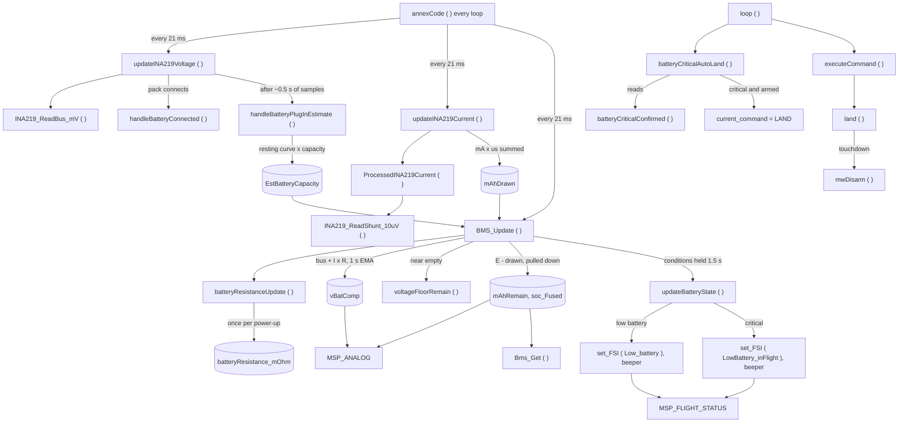

# Battery SoC Fix: Pipeline Update ( staged )

[README](README.md) · [TASKS](TASKS.md) · [INVESTIGATION](INVESTIGATION.md) · [TESTING](TESTING.md) · [CHANGES](CHANGES.md)

Staged for the commit ( task 12, `pluto-commit` ). Nothing here is applied to the pipeline folder before that.

| Part | Goes to |
|---|---|
| A. Power & BMS pipeline | replaces [`subsystems/Power_BMS_Pipeline.md`](../../fw-architecture-pipeline/subsystems/Power_BMS_Pipeline.md) in full |
| B. Other pipeline docs | one-line edits in `Failsafe_Subsystem.md`, `MSP_Communications_Pipeline.md`, `User_Space_API.md` |
| C. CLAUDE.md and dev-guide | two flight-invariant lines |
| D. API wiki | `docs/API/BMS_API_WIKI.md` ( edited in place in this task: it is not a pipeline doc ) |
| E. Drift list | what the old pipeline doc claimed and the code never did |

Line numbers are as of 1 Oct 2026, `src/main/`, with the task 16 change in the working tree.

---

## A. Replacement for `subsystems/Power_BMS_Pipeline.md`

# Battery Management System (BMS) & Power Pipeline

## Overview

The **Pluto Fuel Gauge** estimates the charge left in the pack and raises the low-battery levels. It is a hybrid fuel
gauge: coulomb counting, started from the pack's resting voltage ( OCV ) at plug-in, with a voltage floor compensated
for the pack's internal resistance, which is measured in each flight. At the critical level the
**Low-Battery Auto-Land** flies the craft down and disarms it on touchdown.

The battery is read through an INA219 on I2C: bus voltage and the voltage across one 20 mOhm shunt ( R020 ).

## Source Files

- **Hardware driver:** `src/main/drivers/ina219.c`, `src/main/drivers/ina219.h` ( C )
- **Fuel gauge:** `src/main/sensors/battery.cpp`, `src/main/sensors/battery.h`
- **Scheduling and auto-land trigger:** `src/main/mw.cpp`
- **Landing:** `src/main/command/command.cpp`
- **App reporting:** `src/main/io/serial_msp.cpp` ( `MSP_ANALOG`, `MSP_FLIGHT_STATUS` )
- **User API:** `src/main/API-Src/BMS.cpp`, `src/main/API/BMS.h`

## Key Data

| Name | Unit | Meaning |
|---|---|---|
| `vBat_mV` | mV | Bus voltage, mean of the last 50 samples ( ~1 s ) |
| `vBatRaw` | 0.1 V | `vBat_mV` / 100, floored; kept for its older users ( CRSF ) |
| `mAmpRaw` | mA | Battery current, mean of the last 50 shunt samples, clamped at 0 |
| `mAhDrawn` | mAh | Charge counted out since power-up; saturates at 65535 |
| `EstBatteryCapacity` | mAh | Charge in the pack at plug-in ( the start estimate, "E" ) |
| `mAhRemain` | mAh | Reported charge left; never rises during a power-up; stops at 0 |
| `soc_Fused` | % | `mAhRemain` / configured capacity |
| `batteryResistance_mOhm` | mOhm | Resistance seen at the sensor ( pack, connector, wiring, shunt ); 0 until measured |
| `vBatComp` | mV | Compensated pack voltage: bus + current x resistance, 1 s EMA |
| `batteryState` | - | `BATTERY_OK`, `BATTERY_WARNING`, `BATTERY_CRITICAL`, `BATTERY_NOT_PRESENT` |
| `BatteryWarningMode` | - | 0 OK, 1 low battery, 2 critical |
| `batteryCellCount` | - | 1 to 3, from the plug-in voltage |

The configured capacity ( `batteryCapacity_mAh`: 600, 800, 1200 ) is set in the app for the pack in use.

## Timing

All three run from `annexCode ( )` in `mw.cpp`, each on its own 21 ms interval ( `6 * 3500` us, `mw.cpp:120-123` ).

| Call | Where | Does |
|---|---|---|
| `updateINA219Voltage ( )` | `mw.cpp:430` | reads the bus voltage, handles connect / disconnect and the plug-in estimate |
| `updateINA219Current ( )` | `mw.cpp:442` | reads the shunt, updates the current and the charge counter |
| `BMS_Update ( )` | `mw.cpp:452` | resistance, compensated voltage, remaining, levels |

Each read is one polled I2C transaction. A sensor is marked stale after ~250 ms without a good read: a stale bus
holds the voltage values, a stale current is treated as 0 A in the compensation ( reads low, errs early ).

## How the gauge works

1. **Sensor** ( `drivers/ina219.c` ). `INA219_Init ( )` sets the 16 V bus range and the ±160 mV shunt range, so the
   current range is 8 A with one R020. `INA219_ReadBus_mV ( )` returns mV ( 4 mV steps ); `INA219_ReadShunt_10uV ( )`
   returns the signed shunt voltage in 10 uV steps ( 0.5 mA per step ). Both return false on an I2C error, and a failed
   read is skipped.
2. **Plug-in** ( `battery.cpp:396-444` ). A pack is present at 1000 mV or more. Cells = ceil ( mV / 4400 ), 1 to 3.
   The first ~0.5 s of bus samples are averaged, lifted by the idle current x 120 mOhm to the resting voltage, and
   read per cell on the 21-point 1S LiPo resting curve ( 4.20 V = 100%, 3.27 V = 0%; `battery.cpp:108-112` ). The
   start estimate is that fraction of the configured capacity. It is set once per connect.
3. **Charge counter** ( `battery.cpp:596-619` ). Current x time is summed in mA x us in a 64-bit integer on every
   call; `mAhDrawn` is that sum in mAh. There is no gain or calibration factor.
4. **Pack resistance** ( `batteryResistanceUpdate ( )`, `battery.cpp:722-775` ). The rest point is frozen at the first
   arming. The load point is the mean voltage and current over 25 to 35 s of loaded flight ( armed, at least
   1500 mA ), added up across flights in one power-up. R = voltage drop / current step, less the drop the resting curve
   itself predicts for the charge used; clamped to 80 to 250 mOhm; measured once per power-up. Until then 100 mOhm is
   used.
5. **Compensated voltage** ( `battery.cpp:934-945` ). Per cell: ( bus + current x R ) / cells, smoothed with a 1 s
   EMA. It reads close to the pack's resting voltage while flying. `vBatComp` is that value x cells.
6. **Remaining and SoC** ( `battery.cpp:966-981` ). Remaining = start estimate − counted. Once the compensated
   voltage reads 25% or less on the curve, and less than the count, remaining is pulled down to the voltage figure
   ( loaded flight and a measured R only ). The pull-down is permanent and remaining never rises.
7. **Levels** ( `battery.cpp:983-1059`, `updateBatteryState ( )` `:790` ).

   | Level | Voltage rule ( compensated, per cell ) | Count rule |
   |---|---|---|
   | Low battery | ≤ 3745 mV | ≤ 15% of capacity counted left |
   | Critical | ≤ 3600 mV | ≤ 5% |

   Whichever rule holds for 1.5 s first raises the level. The voltage rule runs only in loaded flight; on the ground
   only the count can raise a level. A level stays until the pack is unplugged. Before R is measured the voltage rule
   runs only once the count is at 40% or less, and a level it raises alone is provisional: it is re-levelled to what
   the count supports on disarm and when R is measured. The levels are raised only while the in-flight low-battery
   failsafe is enabled ( the default ).
8. **Actions per level.** Low battery: `Low_battery` flight-status flag, `BEEPER_BAT_LOW`. Critical:
   `LowBattery_inFlight` flag, `BEEPER_BAT_CRIT_LOW`, and, once confirmed ( not provisional ), the auto-land below and
   `mwArm ( )` ( `mw.cpp:605` ) refusing to arm. The flags and the
   beeper are re-asserted on every update.

**Without current sensing** ( `INA219_Current` not defined: PRIMUSX2, or the current feature off ): SoC is the curve
at the cell voltage, plus 650 mV for hover sag while armed; low battery at a raw loaded cell voltage of 3100 mV and
critical at 3000 mV, armed only. The warning and minimum voltages stored in the config are reported over MSP and are
not used for any decision.

## Low-Battery Auto-Land

`batteryCriticalAutoLand ( )` ( `mw.cpp:1194`, called at `mw.cpp:1426` just before `executeCommand ( )` ) starts the
`LAND` command when the level is a confirmed critical ( `batteryCriticalConfirmed ( )`: critical and not provisional )
and the craft is armed, the same way the RX-loss failsafe does. A provisional critical sounds the beeper but does not
land the craft.

- `land ( )` ( `command.cpp:179` ) ramps `landThrottle` down at 40 counts/s, and disarms on touchdown: descent stopped
  for 0.3 s once the ramp is at 1200 or below ( 2.8 s at the earliest ), a firm vertical contact, or a 30 s timeout.
  The crash detector can also end it at touchdown.
- Only the throttle is taken over ( `mw.cpp:386`, and again after user code at `mw.cpp:1329` ). Roll, pitch and yaw
  stay on the sticks.
- It cannot be cancelled: `MSP_SET_COMMAND` is ignored while landing, and a command set by user code is replaced by
  `LAND` on the next loop. It does not start during a flip; the flip finishes first.
- After the disarm, critical is still latched and `mwArm ( )` refuses to arm until the pack is changed.

## What the app is told

| Message | Field | Value |
|---|---|---|
| `MSP_ANALOG` ( `serial_msp.cpp:999-1007` ) | 10 bytes | `vBatComp` mV u16, `mAmpRaw` mA u16, `mAhDrawn` u16, `mAhRemain` u16, `soc_Fused` % u8, level u8 |
| `MSP_FLIGHT_STATUS` ( `serial_msp.cpp:866-921` ) | u16, one bit | bit 7 `App_Low_battery`, bit 8 `App_LowBattery_inFlight` |

While armed, critical is sent as low battery in both ( level 1, bit 7 ): the app switches its ARM off on bit 8, which
would cut the motors in the air. Once the landing has disarmed the craft, level 2 and bit 8 are sent and the app
blocks arming. The app-side recommendations were sent to the app developer separately.

CRSF battery telemetry ( `mw.cpp:458` ): `vBatRaw` ( 0.1 V ), `mAmpRaw` / 10, `mAhDrawn`, `soc_Fused`.

## User API

`Bms_Get ( option )` ( `API-Src/BMS.cpp:27-58` ): `Voltage` mV, `Current` mA, `mAh_Consumed`, `mAh_Remain`,
`Battery_Capicity`, `Estimated_Capacity`, `SoC` %, `Warning_Level` 0 / 1 / 2 ( not masked: 2 at critical, also while
armed ), `Resistance` mOhm. Wiki: `docs/API/BMS_API_WIKI.md`.

## Limits

- **Current range 8 A** with one R020. A heavier pack or a hard climb can clip the reading and under-count.
- **A second shunt stacked on the R020 halves every current reading** ( 10 mOhm seen as 20 ). Production is one R020.
- **Capacity is the rated value.** A worn pack holds less; the count then reads high and the voltage pull-down
  corrects it near empty.
- **The counted mAh reads ~5% above a charger's refill** on healthy packs, more on worn ones. Not corrected.
- **The start estimate assumes a rested pack.** Straight off the charger it reads slightly high; right after a flight,
  low.
- Measured across packs: resistance 109 to 173 mOhm; low battery with 13 to 20% really left; critical with ~5 to 8%.

## Flow

Every edge, with its source line:

| Edge | Source |
|---|---|
| `annexCode` → `updateINA219Voltage` / `updateINA219Current` / `BMS_Update` | `mw.cpp:430`, `:442`, `:452` |
| `updateINA219Voltage` → `INA219_ReadBus_mV` | `battery.cpp:481` |
| `updateINA219Voltage` → `handleBatteryConnected` | `battery.cpp:494` |
| `updateINA219Voltage` → `handleBatteryPlugInEstimate` | `battery.cpp:512`, `:516` |
| `handleBatteryPlugInEstimate` → `EstBatteryCapacity` | `battery.cpp:440` |
| `updateINA219Current` → `ProcessedINA219Current` | `battery.cpp:599` |
| `ProcessedINA219Current` → `INA219_ReadShunt_10uV` | `battery.cpp:557` |
| `updateINA219Current` → `mAhDrawn` | `battery.cpp:618` |
| `BMS_Update` → `batteryResistanceUpdate` | `battery.cpp:926` |
| `batteryResistanceUpdate` → `batteryResistance_mOhm` | `battery.cpp:773` |
| `BMS_Update` → `vBatComp` | `battery.cpp:944` |
| `EstBatteryCapacity`, `mAhDrawn` → `BMS_Update` | `battery.cpp:966` |
| `BMS_Update` → `voltageFloorRemain` | `battery.cpp:970` |
| `BMS_Update` → `mAhRemain`, `soc_Fused` | `battery.cpp:980-981` |
| `BMS_Update` → `updateBatteryState` | `battery.cpp:1046` |
| `updateBatteryState` → `set_FSI ( Low_battery )`, beeper | `battery.cpp:800-801`, `:823-824` |
| `updateBatteryState` → `set_FSI ( LowBattery_inFlight )`, beeper | `battery.cpp:806-808`, `:818-820`, `:831-832` |
| `loop` → `batteryCriticalAutoLand` | `mw.cpp:1426` |
| `batteryCriticalAutoLand` → `batteryCriticalConfirmed` | `mw.cpp:1196` |
| `batteryCriticalAutoLand` → `current_command = LAND` | `mw.cpp:1210-1211` |
| `loop` → `executeCommand` → `land` | `mw.cpp:1428`, `command.cpp:252` |
| `land` → `mwDisarm` ( `finishLanding` ) | `command.cpp:171` |
| `mAhRemain`, `soc_Fused`, `vBatComp` → `MSP_ANALOG` | `serial_msp.cpp:999-1007` |
| flight-status flags → `MSP_FLIGHT_STATUS` | `serial_msp.cpp:886-896` |
| `mAhRemain` and the rest → `Bms_Get` | `BMS.cpp:29-55` |

---

## B. Other pipeline docs

- **`Failsafe_Subsystem.md`:** add: "Critical battery: `batteryCriticalAutoLand ( )` ( `mw.cpp` ) starts the same
  `LAND` command as the RX-loss failsafe; see Power_BMS_Pipeline." The battery code itself never disarms.
- **`MSP_Communications_Pipeline.md`:** `MSP_ANALOG` is 10 bytes ( table in A ); while armed, critical is reported as
  low battery in `MSP_ANALOG` and `MSP_FLIGHT_STATUS`. Known mismatch: `MSP_VOLTAGE_METER_CONFIG` sends max, minimum,
  warning while `MSP_SET_VOLTAGE_METER_CONFIG` reads max, warning, minimum ( `serial_msp.cpp:1229-1232`, `:1706-1708` );
  the two values are no longer used by the gauge.
- **`User_Space_API.md`:** `Bms_Get` options `SoC`, `Warning_Level`, `Resistance`; API 1.4.0. While a `LAND` runs
  ( `Command_Land`, RX loss or the battery auto-land ), a user throttle override no longer changes the descent: the
  landing throttle is re-applied after user code.

## C. CLAUDE.md and `dev-guide/FLIGHT_INVARIANTS.md`

Add to "Flight invariants" in CLAUDE.md ( full text into `FLIGHT_INVARIANTS.md` ):

- **Battery current is read across one R020 ( 20 mOhm ): a second shunt stacked on it halves every current and mAh
  reading**, and the range tops out at 8 A. The low-battery levels come from the Pluto Fuel Gauge ( count, or
  compensated voltage ≤ 3.745 / 3.60 V per cell ), not from the stored warning / minimum voltages.
- **At critical battery the firmware lands the craft ( `LAND` ) and the app must not be told "critical" while armed** —
  the app switches ARM off on that status and the motors stop in the air. `MSP_FLIGHT_STATUS` and `MSP_ANALOG` report
  low battery until the landing has disarmed.

## D. API wiki

`docs/API/BMS_API_WIKI.md`: a "Low-Battery Auto-Land" section added, and the "Land on critical" example replaced
( the firmware now does it ). There is no `Command_Land` wiki in `docs/API/` yet ( only BMS and OLED ), so the
`Command_Land` behaviour change is recorded in B ( `User_Space_API.md` ) and in the CHANGELOG entry.

## E. Drift list: what the old pipeline doc said

| Old doc | Actual |
|---|---|
| driver `ina219.cpp` | `ina219.c` ( C ) |
| `vbat` in 0.1 V, `amperage` in cA | `vBat_mV` in mV, `mAmpRaw` in mA; `vBatRaw` is the 0.1 V copy |
| `ina219Init ( )`, `batteryUpdate ( )`, `updateBatteryStatus ( )` | `INA219_Init ( )`, `updateINA219Voltage ( )` / `updateINA219Current ( )` / `BMS_Update ( )`, `updateBatteryState ( )` |
| levels from `vbat` against per-cell config minimums | count and compensated voltage, fixed firmware thresholds; config voltages unused |
| "Notify Failsafe System" at critical | nothing landed or disarmed before this topic; now `batteryCriticalAutoLand ( )` |
| ADC fallback when there is no INA219 | none: without the INA219 no pack is seen |
| 2S / 3S support, 3.2 A or 32 A range | cell count 1 to 3 is detected, but only 1S is tested; the range is 8 A |
| a low-pass filter prevents sag from tripping the warning | the voltage is compensated for the load and each condition must hold 1.5 s |
