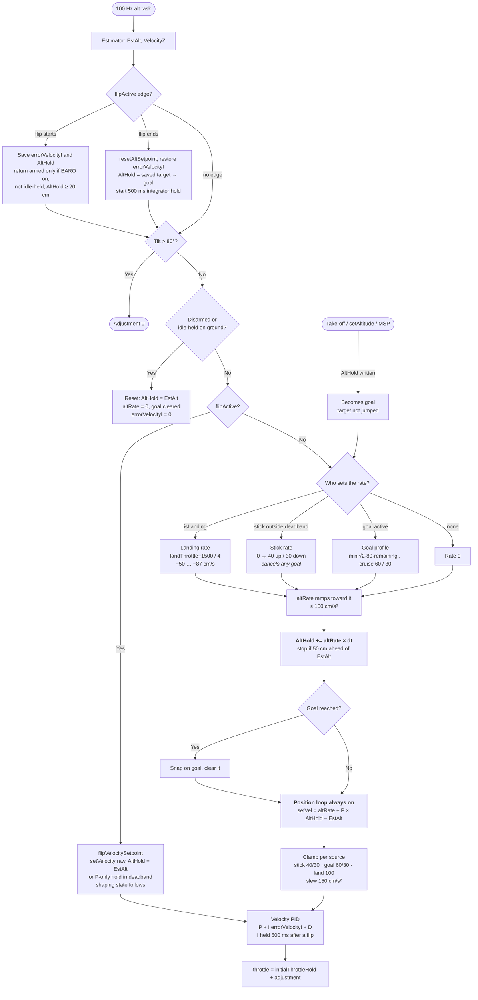
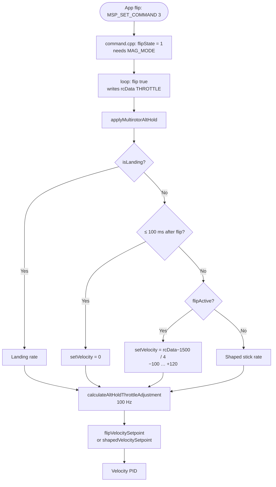
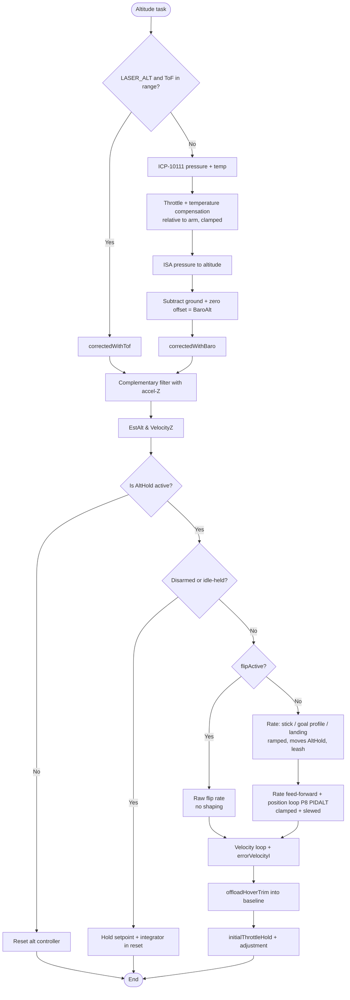

# PIPELINE_UPDATE: flip-althold-regression

Staged for commit. **Target:** `fw-architecture-pipeline/subsystems/Altitude_Hold_Estimator.md`,
replaced by the full text below the line. `Firmware_Pipeline.md` does not change (no new
task or loop stage). No DMA / timer / pin or public API changes, so no map or `docs/API/`
updates.

What changed against the current doc:
- Key data structures: `flipState` / `flipActive()`. Source files: `acrobats.cpp`.
- Primary functions: `applyMultirotorAltHold()` (exit-ignore window and flip branch),
  `calculateAltHoldThrottleAdjustment()` (flip edge handling, `flipVelocitySetpoint()` /
  `shapedVelocitySetpoint()`).
- `altRate` source table: a Flip row.
- The `calculateAltHoldThrottleAdjustment()` flowchart: edge block, flip branch, integrator hold.
- New section **Flip interaction**, with its own flowchart.
- The estimator/controller flowchart: flip branch.

Every diagram edge was checked against the source (2026-09-21):
- `mw.cpp`: 1255 `flip ( true )` → 1278 `annexCode()` → 1317 `applyAltHold()`; 772
  `apmCalculateEstimatedAltitude()`; 904 `updateActivatedModes()`.
- `altitudehold.cpp`: 835 `calculateAltHoldThrottleAdjustment()` (from the estimator);
  366 `applyMultirotorAltHold()` (410 exit window, 412 flip branch); 506 / 517 edges;
  527 tilt return; 535 ground reset; 544 setpoint selection; 556 integrator hold.
- `rc_controls.h`: 69 `DEACTIVATE_RC_MODE` (XOR).

The knowledge graph predates these functions, so it was not used for the check.

## CLAUDE.md addition (draft, applied at commit)

Add after the ALT_HOLD paragraph:

> **During a flip, altitude hold is bypassed, not switched off.** `flip()`'s
> `DEACTIVATE_RC_MODE(BOXBARO)` is an XOR that `updateActivatedModes()` undoes on the next
> RX frame, so BARO_MODE stays on while the app holds AUX3. The flip drives
> `rcData[THROTTLE]` (2000 in ASCEND/HOLD), and `calculateAltHoldThrottleAdjustment()`
> flies the raw rate for it (`flipVelocitySetpoint()`): ASCEND needs 100 cm/s, and the
> shaped 40 cm/s never gets there. On flip exit the setpoint is reset, the pre-flip
> integrator is restored and held for 500 ms, and the pre-flip `AltHold` becomes a goal.
> Details: `fw-architecture-pipeline/subsystems/Altitude_Hold_Estimator.md` (Flip
> interaction) and `active-development/flip-althold-regression/`.

---

# Altitude Hold & Estimator (`altitudehold.cpp`)

## Overview
Fuses barometric pressure (and, when `LASER_ALT` is defined, laser Time-of-Flight) with the accelerometer's Z-axis to estimate altitude and vertical velocity. When `ALT_HOLD` mode is active, it takes over the throttle channel to hold or smoothly change height.

## Source Files
- **Altitude estimator and controller**: `src/main/flight/altitudehold.cpp`, `src/main/flight/altitudehold.h`
- **Barometer chain**: `src/main/sensors/barometer.cpp` (conversion, zero, compensation), `src/main/drivers/barometer_icp10111.cpp` (ICP-10111 driver)
- **Laser**: `src/main/drivers/ranging_vl53l0x.cpp` (only used by the estimator with `LASER_ALT`)
- **Flip** (drives the throttle during a flip): `src/main/flight/acrobats.cpp`, `acrobats.h`
- **XY position** (not altitude): `src/main/flight/posEstimate.cpp`, `src/main/flight/posControl.cpp`

## Key Data Structures
- `EstAlt`: estimated altitude in cm. What the controller and `limitAltitude()` use.
- `VelocityZ`: estimated vertical velocity in cm/s.
- `BaroAlt`: compensated barometric altitude in cm, the measurement the estimator is corrected towards. Noisier than `EstAlt` by design.
- `AltHold`: the altitude setpoint. Moved by the setpoint shaping below; a write from outside becomes a goal ( `altGoal` ) rather than a step. `altTarget` is its float copy.
- `altRate`: the ramped rate moving `AltHold` ( stick rate or goal profile ), fed forward to the velocity loop.
- `initialThrottleHold`: the hover-throttle baseline. `errorVelocityI` (the only alt-hold integrator) carries the residual trim.
- `flipState` (`flight/acrobats.cpp`): non-zero while an app / `Command_Flip()` flip runs. `flipActive()` wraps it, and is always false without `ENABLE_ACROBAT`.

## Primary Functions
- `apmCalculateEstimatedAltitude()`: runs the third-order complementary filter each altitude task, integrating accel-Z and correcting towards the height measurement.
- `checkBaro()` → `correctedWithBaro()`: barometer path (no `LASER_ALT`). Time constant `_time_constant_z` is 2 s, or 5 s above 30° of tilt.
- `checkReading()` → `correctedWithTof()`: with `LASER_ALT`, laser below 200 cm (hard switch, no blend), barometer above, with `baro_offset` aligning the two at handover.
- `applyAltHold()` → `applyMultirotorAltHold()` (main loop): turns the throttle stick into `setVelocity` (landing descent while `isLanding`, 0 for `ALT_FLIP_EXIT_IGNORE_MS` after a flip, the raw flip rate while a flip runs), sets `altHoldGroundIdle`, and writes `rcCommand[THROTTLE] = initialThrottleHold + altHoldThrottleAdjustment`.
- `calculateAltHoldThrottleAdjustment()` (100 Hz): flip edge handling, then the velocity setpoint from `shapedVelocitySetpoint()` (setpoint shaping: fed-forward rate plus the outer position loop, `P8[PIDALT]`, 128 = unity) or, during a flip, `flipVelocitySetpoint()`, feeding the inner velocity loop.
- `offloadHoverTrim()`: while settled, moves hover trim from `errorVelocityI` into `initialThrottleHold` one count per 20 ms, keeping the integrator's range free.
- `limitAltitude()`: altitude ceiling at `max_altitude - ALT_CEILING_MARGIN_CM` (25 cm).

## Barometer chain (`sensors/barometer.cpp`)

The ICP-10111 does not report the true static pressure of the air: rotor inflow and the board's heating both shift it. The chain from raw reading to `BaroAlt`:

1. **Driver** (`barometer_icp10111.cpp`): `NORMAL` measurement mode (~7 ms conversion). Die temperature is low-pass filtered (`TEMP_LPF_ALPHA`) and feeds the sensor's own compensation polynomial.
2. **Compensation** (`baroCompensationPa()`): adds back pressure lost to throttle and temperature, relative to the values latched at the arm instant, so it is zero on the first armed sample:
   - `BARO_COMP_THROTTLE_PA_PER_COUNT` = 0.0086 Pa per `rcCommand[THROTTLE]` count
   - `BARO_COMP_TEMP_PA_PER_DEGC` = 2.1 Pa per °C of die temperature (measured −2.17 to −2.42 on PRIMUS_V5)
   - total clamped to ±`BARO_COMP_LIMIT_PA` (25 Pa, ~2 m)
3. **Conversion** (`pressureToAltitude()`): ISA standard atmosphere at a fixed 288.15 K. Deliberately temperature-free, so the scale does not depend on how warm the board is. About 8.3 cm per Pa near sea level.
4. **Zero** (`baroUpdateZero()`): while disarmed, an IIR tracks the reading so warm-up before takeoff is absorbed; frozen on arm. Applied as an offset (`getBaroZeroOffset()`).

`BaroAlt = altitude(pressure + compensation) − ground altitude − zero offset`.

Rules that keep this working:
- **Never re-zero in flight.** `baroResetGroundLevel()` is only allowed before the throttle has been raised since arming (`throttleRaisedSinceArm` in `mw.cpp`).
- **Keep estimator lag low.** A slow estimate lags high during a descent and commands more descent; adding filtering to `BaroAlt` trades noise for exactly this.
- **Coefficients are per airframe.** The throttle term depends on where the FC sits relative to the rotors. Re-measure on a new frame from a log of `degC`, `PaI` and laser height over a 3+ minute hover.

## Data Flow & Boundaries
- **Stick deadband**: in `ALT_HOLD`, `alt_hold_deadband` (40 counts, stick 1460-1540) is applied to the throttle stick. Inside it the drone holds altitude; beyond it, the stick sets a climb/descent rate. There is no deadband on the position error.

## Setpoint shaping (`calculateAltHoldThrottleAdjustment()`)

ArduPilot / DJI style: the throttle stick never takes the position loop out of the chain. It moves the setpoint, and the loop tracks the moving setpoint with the rate fed forward.

Why it is built this way:
- **One controller, no mode switch.** Earlier firmware switched to a raw velocity command outside the deadband and snapped `AltHold` to `EstAlt` on return. That gave a speed step at the deadband edge and an overshoot on centring.
- **Feed-forward instead of a gap.** A P = 1 position loop needs a 60 cm error to demand 60 cm/s, so a stepped target is approached ever more slowly. Feeding the planned rate forward leaves the position term as a small correction.
- **Height stays controlled while the stick is in use**, and stick, commands and landing are all bounded by the same ramp and clamp.

The legacy flow, the full comparison and the reasoning are in [althold-setpoint-shaping/CHANGES.md](../../active-development/althold-setpoint-shaping/CHANGES.md#before--after).

| Source of `altRate` | Rate | Limits |
|---|---|---|
| **Stick** outside the deadband | Linear from 0 at the deadband edge to full stick | `ALT_MAX_CLIMB_CMS` 40 / `ALT_MAX_DESCENT_CMS` 30 cm/s |
| **Goal**: `AltHold` written from outside (take-off, `DesiredPosition_set*` / `setAltitude()`, MSP) | Trapezoid: `min(sqrt(2·a·remaining), cruise)`, stops on the goal | Cruise `ALT_CMD_MAX_CLIMB_CMS` 60 / `ALT_CMD_MAX_DESCENT_CMS` 30 cm/s, brake `ALT_GOAL_DECEL_CMSS` 80 cm/s² |
| **Landing** (`isLanding`) | `(landThrottle − 1500) / 4`: land() ramps 1300 → 1150, i.e. about −50 → −87 cm/s | Descent clamp `ALT_LAND_MAX_DESCENT_CMS` 100 |
| **Flip** (`flipActive()`) | Not shaped. `(rcData[THROTTLE] − 1500) / 4` fed straight to the velocity loop, see *Flip interaction* | `ALT_FLIP_MAX_CLIMB_CMS` 120 / `ALT_FLIP_MAX_DESCENT_CMS` 100, no ramp, slew or leash |

Each 10 ms tick:
1. `altRate` ramps toward the source rate at `ALT_STICK_ACCEL_CMSS` (100 cm/s²). Moving the stick cancels a goal.
2. `AltHold += altRate · dt`. It stops advancing when it is `ALT_TARGET_LEASH_CM` (50) ahead of `EstAlt` in the direction of travel, e.g. while still on the ground.
3. Velocity demand = `altRate + P_ALT · (AltHold − EstAlt)`. It is clamped to the limits of the active source and slewed at `ALT_VEL_ACCEL_CMSS` (150 cm/s²), then goes to the velocity PID.

Behaviour that follows: centring the stick lets the target coast to a stop, with no snap to `EstAlt` and no overshoot. A 120 cm take-off takes about 2.7 s with no slow final approach.

Flow of `calculateAltHoldThrottleAdjustment()`:

## Flip interaction (`flight/acrobats.cpp`)

An app back-flip (MSP `MSP_SET_COMMAND` 3, or `Command_Flip()` from user code) runs the
`flip()` state machine in `loop()` (`mw.cpp`, `flip ( true )` before `annexCode()` and
`applyAltHold()`). It needs `MAG_MODE` to start, and back flip is the only direction.

- **ALT_HOLD stays on during the flip.** `flip()` calls `DEACTIVATE_RC_MODE(BOXBARO)`, but
  that is an XOR on `rcModeActivationMask`, and `updateActivatedModes()` rebuilds the mask
  from the AUX channels on every RX frame. While the app holds AUX3 (BOXBARO), BARO_MODE
  never drops, so altitude hold flies the whole flip.
- **The flip drives `rcData[THROTTLE]` itself:** 2000 in ASCEND (state 1, until
  `VelocityZ ≥ 100 cm/s`, time-out 2.2 s) and in HOLD / HOLDPOS (states 4 / 7, a fixed
  1.5 s recovery), with no write in PITCHING / SLOWDOWN. Altitude hold reads `rcData`
  here on purpose: `flip()` writes it earlier in the same `loop()` pass. The raw branch
  is gated on `flipActive()`, so outside a flip the same `rcData` read goes through
  shaping, and a pilot's 2000 is still limited to 40 cm/s.
- **While `flipActive()`, setpoint shaping is bypassed.** `flipVelocitySetpoint()` flies
  the pre-shaping controller: outside the deadband `setVelocity = (rcData − 1500) / 4`
  (−100…+120 cm/s) goes straight to the velocity loop with `AltHold` pinned to `EstAlt`.
  Inside it, a P-only position hold runs. Through shaping, full stick is 40 cm/s and
  ASCEND never reached 100 cm/s, so the flip timed out without rotating. The shaping
  state (`altTarget`, `altRate`, goal) follows during the flip.
- **Hand-back on the flip's falling edge** (checked ahead of the tilt test):
  - `resetAltSetpoint()`: the setpoint restarts at 0. The flip's last 120 cm/s was
    otherwise slewed down slowly, and together with HOLD's integrator wind-up it drove a
    flyaway.
  - `errorVelocityI` is restored to the value saved when the flip started (0 if BARO was
    off then), which drops HOLD's wind-up.
  - `AltHold` is set to the target saved when the flip started, and becomes a goal flown
    on the goal profile (HOLD ends the flip 40-120 cm high). This is only done if BARO
    was on, the craft was not idle-held, and the target was ≥ `ALT_FLIP_RETURN_MIN_CM`
    (20 cm). Otherwise the craft holds where the flip ended. Stick input cancels it, as
    for take-off.
  - For `ALT_FLIP_EXIT_I_HOLD_MS` (500 ms) the velocity integrator is held while P brakes
    the ~120 cm/s exit climb, so no negative trim is banked. The disarm reset clears the
    window.
- **The stale exit throttle is ignored.** On its last tick the flip writes 2000 and clears
  `flipState` in the same call. For `ALT_FLIP_EXIT_IGNORE_MS` (100 ms, more than the
  ≤ 20 ms RX refresh) `applyMultirotorAltHold()` forces `setVelocity = 0`, so that sample
  cannot cancel the return goal. Landing keeps priority.

Known limits: with `alt_hold_fast_change = 1` (default 0) there is no return. A flip sent
during a take-off or `setAltitude()` goal returns to where the moving target was, not to
the goal. A second flip started within 100 ms of the previous one ending gets
`setVelocity = 0` for the rest of the exit window (ASCEND starts up to 100 ms late, well
inside its 2.2 s time-out). After the rotation the altitude estimate re-converges (a 16-42 cm transient in
`EstAlt`, and `VelocityZ` biased about −13 cm/s for a few seconds). This is not addressed.

**Ground reset:** while disarmed, or armed on the throttle stick with the motors held at 1000 (`isThrottleStickArmed` → `altHoldGroundIdle`), the setpoint, goal, rate and `errorVelocityI` are held in reset. Waiting armed on the ground therefore cannot wind the integrator down.

**Landing must keep its own descent rate.** Near the floor the barometer drifts low in the craft's own downwash. At the stick's 10-20 cm/s that drift alone met the descent demand: the craft hovered a few cm up with `EstAlt` still falling, and `land()`'s touchdown test (descent stopped) never fired.

**Not covered:** there is no general landed detector. A touchdown and re-take-off without disarming can still wind the integrator down. `limitAltitude()` only clamps the stick, and the target coasts about 8 cm past the clamp, which is inside the 25 cm margin.
- **ToF vs Baro**: with `LASER_ALT`, the VL53L0X (200 cm) or VL53L1X (350 cm) replaces the barometer below its range. Without it, the estimator is barometer and accel-Z only. `LASER_TOF` alone reads the laser for logging and does not affect altitude.

