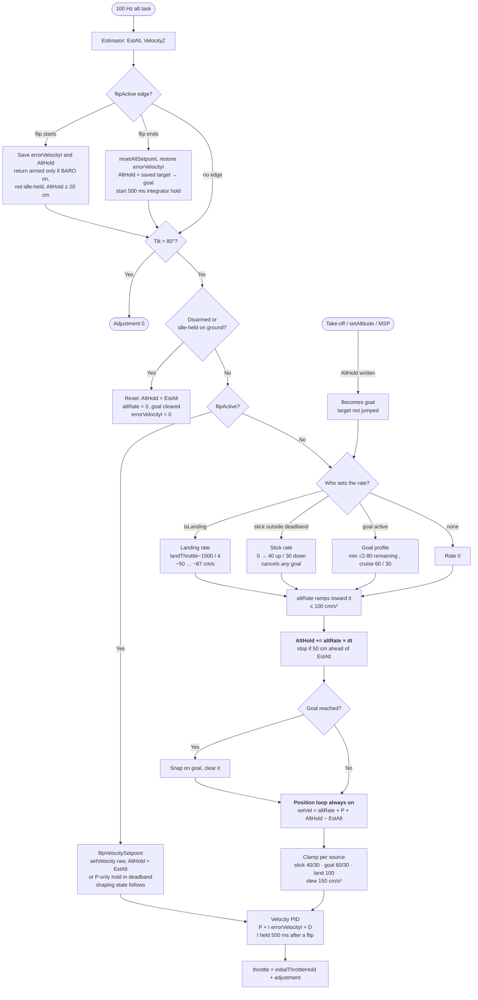
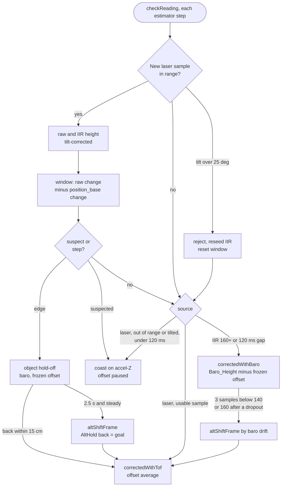
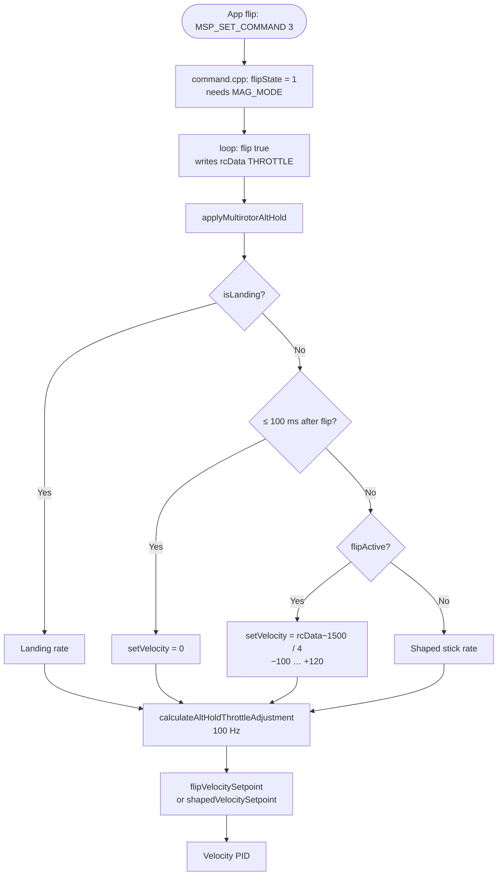
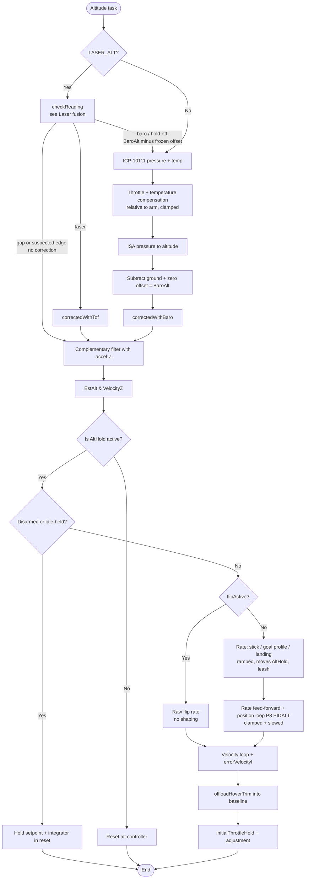

# PIPELINE_UPDATE: tof-althold-fusion

Staged for commit. Apply in `commit-magisv2`; do not edit `fw-architecture-pipeline/` before then.

## 1. `fw-architecture-pipeline/subsystems/Altitude_Hold_Estimator.md`

Replaced by the full text in section 4. What changed against the current doc:

- Source files: the laser driver's IIR and the accelerometer sum in `imu.cpp`.
- Primary functions: `checkReading()` as a source selector, `correctedWithTof()` ( error against
  `_position_z`, one tau ), `altShiftFrame()`, `altHoldSource()`.
- New section **Laser fusion**: the Z deadband, the filter, the handover table, the object hold-off
  with the window test, the limits, and a flowchart of `checkReading()`.
- The ToF vs Baro note ( no more hard 200 cm switch for the VL53L0X ) and the first step of the
  estimator flowchart.

Every new diagram edge was checked against the source ( 22 Sep 2026 ):

- `mw.cpp:772` `apmCalculateEstimatedAltitude()`; `mw.cpp:804-808` `UPDATE_LASER_TOF_TASK` → `getRange()`.
- `altitudehold.cpp:849` `checkReading()` under `LASER_ALT`, `:847` `checkBaro()` otherwise.
- `imu.cpp:268` `accSum[Z]` with `ALT_EST_ACC_Z_DEADBAND` ( `:270` the profile value without
  `LASER_ALT` ) → `altitudehold.cpp:853` `accel_ef_z`.
- `altitudehold.cpp:1018` tilt reject → `tofRequestReseed()`; `ranging_vl53l0x.cpp:212-218` reseed and
  `NewSensorRange`.
- `altitudehold.cpp:1047` call of `tofWindowMismatch()` ( defined at `:929` ); `:1114` / `:1133` / `:1148` reseed at detection,
  cancel, re-base; `:1141` `altShiftFrame()` and `:1144` `AltHold` back as a goal ( read as a goal at
  `:639` ).
- `altitudehold.cpp:1173` / `:1176` laser → baro; `:1184` return shift; `:1199` `correctedWithTof()`,
  `:1204` `correctedWithBaro()`.

## 2. Other pipeline docs

- `Firmware_Pipeline.md`: no change. No new task or loop stage ( the laser task and the altitude
  task already exist ).
- `IMU_Sensor_Fusion_Pipeline.md`, `Hardware_Bus_Pipeline.md`, `User_Space_API.md`: no change ( they
  do not describe `accSum` or the laser path ).
- No DMA / timer / pin change, no public API change: no map or `docs/API/` update.

## 3. `CLAUDE.md` and skill text

- `CLAUDE.md`, replace the `Monitor_Print` paragraph with:

  > **Keep `Monitor_Print` under ~130 bytes per tick with the app connected.** It writes into the
  > MSP UART's 256-byte TX ring buffer ( 115200 baud, ~22 ms to drain ) and `uartWrite()` does not
  > check for full, so an overrun overwrites unsent bytes: the start of the log line, or, as seen in
  > `tof-althold-fusion`, apparently the app's own MSP replies, and the app disconnects ( ~180 B/tick
  > did; 115-135 B/tick ran clean; the exact limit is not measured ). Also: the double overload prints
  > 0 for every digit after the first decimal.

- `CLAUDE.md`, add after the altitude-hold paragraphs:

  > **With `LASER_ALT` ( VL53L0X ) the laser corrects the altitude estimator below 160 cm and hands
  > over to the baro above it ( back below 140 cm ), with the whole altitude frame shifted on the
  > return so the craft does not move.** A sudden change of surface under the craft ( the laser
  > disagreeing with the accelerometer by more than 30 cm within 0.5 s, or more than 20 cm building
  > up within ~1 s ) holds the estimate on the baro for 2.5 s, then re-bases to the new surface and
  > flies back to the old clearance as a goal; smaller or slower changes are followed as terrain.
  > The accelerometer Z deadband is 0 for the estimator in `LASER_ALT` builds ( `ALT_EST_ACC_Z_DEADBAND`; the
  > 40-count profile value made hover velocity 0.3-0.4 × real ). Details: `Altitude_Hold_Estimator.md`
  > ( Laser fusion ) and `active-development/tof-althold-fusion/`.

- Change "~250 bytes" to "~130 bytes with the app connected" and add the disconnect symptom in:
  `.claude/skills/magisv2-rules/SKILL.md` lines 93 and 153, `.claude/skills/magisv2-rules/references/invariants.md`
  line 86, `.claude/skills/flight-test/SKILL.md` lines 22 and 74, `.claude/skills/add-driver/SKILL.md`
  line 80.

## 4. New text of `Altitude_Hold_Estimator.md`

---

# Altitude Hold & Estimator (`altitudehold.cpp`)

## Overview
Fuses barometric pressure (and, when `LASER_ALT` is defined, laser Time-of-Flight) with the accelerometer's Z-axis to estimate altitude and vertical velocity. When `ALT_HOLD` mode is active, it takes over the throttle channel to hold or smoothly change height.

## Source Files
- **Altitude estimator and controller**: `src/main/flight/altitudehold.cpp`, `src/main/flight/altitudehold.h`
- **Barometer chain**: `src/main/sensors/barometer.cpp` (conversion, zero, compensation), `src/main/drivers/barometer_icp10111.cpp` (ICP-10111 driver)
- **Laser**: `src/main/drivers/ranging_vl53l0x.cpp` (VL53L0X, 33 ms single ranging, `LASER_LPS` 0.1 IIR; only used by the estimator with `LASER_ALT`)
- **Accelerometer sum**: `src/main/flight/imu.cpp` `imuCalculateAcceleration()` (builds `accSum[Z]`, the estimator's vertical acceleration)
- **Flip** (drives the throttle during a flip): `src/main/flight/acrobats.cpp`, `acrobats.h`
- **XY position** (not altitude): `src/main/flight/posEstimate.cpp`, `src/main/flight/posControl.cpp`

## Key Data Structures
- `EstAlt`: estimated altitude in cm. What the controller and `limitAltitude()` use.
- `VelocityZ`: estimated vertical velocity in cm/s.
- `BaroAlt`: compensated barometric altitude in cm, the measurement the estimator is corrected towards. Noisier than `EstAlt` by design.
- `AltHold`: the altitude setpoint. Moved by the setpoint shaping below; a write from outside becomes a goal ( `altGoal` ) rather than a step. `altTarget` is its float copy.
- `altRate`: the ramped rate moving `AltHold` ( stick rate or goal profile ), fed forward to the velocity loop.
- `initialThrottleHold`: the hover-throttle baseline. `errorVelocityI` (the only alt-hold integrator) carries the residual trim.
- `flipState` (`flight/acrobats.cpp`): non-zero while an app / `Command_Flip()` flip runs. `flipActive()` wraps it, and is always false without `ENABLE_ACROBAT`.

## Primary Functions
- `apmCalculateEstimatedAltitude()`: runs the third-order complementary filter each altitude task, integrating accel-Z and correcting towards the height measurement.
- `checkBaro()` → `correctedWithBaro()`: barometer path (no `LASER_ALT`). Time constant `_time_constant_z` is 2 s, or 5 s above 30° of tilt.
- `checkReading()` (with `LASER_ALT`): chooses the correction source each estimator step: `correctedWithTof()` on the laser, `correctedWithBaro()` with a frozen offset on the baro or during an object hold-off, or no correction ( coast ) during a short gap or a suspected edge. See **Laser fusion** below.
- `correctedWithTof()`: position error against the filter's own `_position_z`; one time constant `ALT_EST_TAU_S` 1.5 s for both sources under `LASER_ALT`.
- `altShiftFrame()`: moves the whole altitude frame ( estimate, its history, the smoother, the setpoint, the goal and the flip's return height ) by one amount, so a change of reference does not move the craft.
- `altHoldSource()`: 1 laser, 0 baro, 2 object hold-off ( diagnostics ).
- `applyAltHold()` → `applyMultirotorAltHold()` (main loop): turns the throttle stick into `setVelocity` (landing descent while `isLanding`, 0 for `ALT_FLIP_EXIT_IGNORE_MS` after a flip, the raw flip rate while a flip runs), sets `altHoldGroundIdle`, and writes `rcCommand[THROTTLE] = initialThrottleHold + altHoldThrottleAdjustment`.
- `calculateAltHoldThrottleAdjustment()` (100 Hz): flip edge handling, then the velocity setpoint from `shapedVelocitySetpoint()` (setpoint shaping: fed-forward rate plus the outer position loop, `P8[PIDALT]`, 128 = unity) or, during a flip, `flipVelocitySetpoint()`, feeding the inner velocity loop.
- `offloadHoverTrim()`: while settled, moves hover trim from `errorVelocityI` into `initialThrottleHold` one count per 20 ms, keeping the integrator's range free.
- `limitAltitude()`: altitude ceiling at `max_altitude - ALT_CEILING_MARGIN_CM` (25 cm).

## Barometer chain (`sensors/barometer.cpp`)

The ICP-10111 does not report the true static pressure of the air: rotor inflow and the board's heating both shift it. The chain from raw reading to `BaroAlt`:

1. **Driver** (`barometer_icp10111.cpp`): `NORMAL` measurement mode (~7 ms conversion). Die temperature is low-pass filtered (`TEMP_LPF_ALPHA`) and feeds the sensor's own compensation polynomial.
2. **Compensation** (`baroCompensationPa()`): adds back pressure lost to throttle and temperature, relative to the values latched at the arm instant, so it is zero on the first armed sample:
   - `BARO_COMP_THROTTLE_PA_PER_COUNT` = 0.0086 Pa per `rcCommand[THROTTLE]` count
   - `BARO_COMP_TEMP_PA_PER_DEGC` = 2.1 Pa per °C of die temperature (measured −2.17 to −2.42 on PRIMUS_V5)
   - total clamped to ±`BARO_COMP_LIMIT_PA` (25 Pa, ~2 m)
3. **Conversion** (`pressureToAltitude()`): ISA standard atmosphere at a fixed 288.15 K. Deliberately temperature-free, so the scale does not depend on how warm the board is. About 8.3 cm per Pa near sea level.
4. **Zero** (`baroUpdateZero()`): while disarmed, an IIR tracks the reading so warm-up before takeoff is absorbed; frozen on arm. Applied as an offset (`getBaroZeroOffset()`).

`BaroAlt = altitude(pressure + compensation) − ground altitude − zero offset`.

Rules that keep this working:
- **Never re-zero in flight.** `baroResetGroundLevel()` is only allowed before the throttle has been raised since arming (`throttleRaisedSinceArm` in `mw.cpp`).
- **Keep estimator lag low.** A slow estimate lags high during a descent and commands more descent; adding filtering to `BaroAlt` trades noise for exactly this.
- **Coefficients are per airframe.** The throttle term depends on where the FC sits relative to the rotors. Re-measure on a new frame from a log of `degC`, `PaI` and laser height over a 3+ minute hover.

## Data Flow & Boundaries
- **Stick deadband**: in `ALT_HOLD`, `alt_hold_deadband` (40 counts, stick 1460-1540) is applied to the throttle stick. Inside it the drone holds altitude; beyond it, the stick sets a climb/descent rate. There is no deadband on the position error.

## Setpoint shaping (`calculateAltHoldThrottleAdjustment()`)

ArduPilot / DJI style: the throttle stick never takes the position loop out of the chain. It moves the setpoint, and the loop tracks the moving setpoint with the rate fed forward.

Why it is built this way:
- **One controller, no mode switch.** Earlier firmware switched to a raw velocity command outside the deadband and snapped `AltHold` to `EstAlt` on return. That gave a speed step at the deadband edge and an overshoot on centring.
- **Feed-forward instead of a gap.** A P = 1 position loop needs a 60 cm error to demand 60 cm/s, so a stepped target is approached ever more slowly. Feeding the planned rate forward leaves the position term as a small correction.
- **Height stays controlled while the stick is in use**, and stick, commands and landing are all bounded by the same ramp and clamp.

The legacy flow, the full comparison and the reasoning are in [althold-setpoint-shaping/CHANGES.md](../../active-development/althold-setpoint-shaping/CHANGES.md#before--after).

| Source of `altRate` | Rate | Limits |
|---|---|---|
| **Stick** outside the deadband | Linear from 0 at the deadband edge to full stick | `ALT_MAX_CLIMB_CMS` 40 / `ALT_MAX_DESCENT_CMS` 30 cm/s |
| **Goal**: `AltHold` written from outside (take-off, `DesiredPosition_set*` / `setAltitude()`, MSP) | Trapezoid: `min(sqrt(2·a·remaining), cruise)`, stops on the goal | Cruise `ALT_CMD_MAX_CLIMB_CMS` 60 / `ALT_CMD_MAX_DESCENT_CMS` 30 cm/s, brake `ALT_GOAL_DECEL_CMSS` 80 cm/s² |
| **Landing** (`isLanding`) | `(landThrottle − 1500) / 4`: land() ramps 1300 → 1150, i.e. about −50 → −87 cm/s | Descent clamp `ALT_LAND_MAX_DESCENT_CMS` 100 |
| **Flip** (`flipActive()`) | Not shaped. `(rcData[THROTTLE] − 1500) / 4` fed straight to the velocity loop, see *Flip interaction* | `ALT_FLIP_MAX_CLIMB_CMS` 120 / `ALT_FLIP_MAX_DESCENT_CMS` 100, no ramp, slew or leash |

Each 10 ms tick:
1. `altRate` ramps toward the source rate at `ALT_STICK_ACCEL_CMSS` (100 cm/s²). Moving the stick cancels a goal.
2. `AltHold += altRate · dt`. It stops advancing when it is `ALT_TARGET_LEASH_CM` (50) ahead of `EstAlt` in the direction of travel, e.g. while still on the ground.
3. Velocity demand = `altRate + P_ALT · (AltHold − EstAlt)`. It is clamped to the limits of the active source and slewed at `ALT_VEL_ACCEL_CMSS` (150 cm/s²), then goes to the velocity PID.

Behaviour that follows: centring the stick lets the target coast to a stop, with no snap to `EstAlt` and no overshoot. A 120 cm take-off takes about 2.7 s with no slow final approach.

Flow of `calculateAltHoldThrottleAdjustment()`:

## Laser fusion (`LASER_ALT`, VL53L0X)

With a downward laser, altitude hold means height above the surface under the craft: gentle
terrain is followed. `checkReading()` decides each estimator step what corrects the complementary
filter. The accelerometer input, the single time constant and the laser error against
`_position_z` apply to every `LASER_ALT` build. The handover, the object hold-off and the window
test are VL53L0X-only ( `LASER_TOF` ); the VL53L1X branch ( `LASER_TOF_L1x` ) keeps its hard 350 cm
switch.

**Accelerometer input.** Under `LASER_ALT`, `accSum[Z]` is built without a deadband
( `ALT_EST_ACC_Z_DEADBAND` 0 counts, a compile-time constant, so a saved profile cannot bring the old
value back ). The profile's 40-count Z deadband ( ~9.6 cm/s² ) removed most of a hover's vertical
acceleration: `VelocityZ` read 0.3-0.4 × the real speed, the velocity loop had a third of its
damping, and the craft bobbed 30 cm at ~4 s. Baro-only builds keep `accDeadband.z`. `accSum[Z]`
also reaches the velocity loop's D term through `accZ_tmp`; at the default `d_vel` 1 the term is 0
until the sum of two consecutive averages ( `accZ_tmp + accZ_old` ) reaches 512 counts, ~256 per
sample.

**Filter.** One time constant `ALT_EST_TAU_S` 1.5 s for both sources. The laser error is taken
against the filter's `_position_z`, not the smoothed integer `EstAlt`. The driver IIR keeps float
state and is reseeded from the raw sample after an out-of-range sample, a rejected tilted sample,
and at every object detection, cancel and re-base ( `tofRequestReseed()` ). Laser samples above
`ALT_TOF_MAX_TILT_DECIDEG` 25° are rejected. The driver IIR lags ~0.3 s ( `ALT_TOF_IIR_LAG_S` ). The
laser is advanced by `VelocityZ × 0.3 s` for the baro-offset average and the return shift; the
object test advances the estimate by the same amount instead. The estimator correction itself uses
the IIR reading as it is.

**Handover** ( `altSourceLaser` ):

| From | To | When |
|---|---|---|
| laser | baro | the IIR laser height reads ≥ `ALT_TOF_HANDOVER_UP_CM` 160 cm; or no usable sample for `ALT_TOF_DROPOUT_MS` 120 ms ( dropout, tilt, silent sensor ); or a suspected edge times out with the laser ≥ 160 cm, or an escalated edge gets no usable sample within 120 ms |
| baro | laser | `ALT_TOF_RETURN_SAMPLES` 3 usable samples below `ALT_TOF_HANDOVER_DOWN_CM` 140 cm after a climb above the band, otherwise below 160 cm |

Short gaps: out-of-range and tilted samples coast on the accelerometer ( no correction ) until the
120 ms timeout. A sensor that simply stops reporting keeps its last reading usable, so the
estimator keeps correcting towards that reading until the timeout.

On the laser, `baro_offset` is a 2 s ( `ALT_BARO_OFFSET_TAU_S` ) average of baro minus laser, paused
during a hold-off, while a change is suspected, and for 400 ms after the window resets; the time
step of each update is clamped to 0.05 s, so the first sample after a pause gets a normal weight. On the baro it is frozen. On the return, `altShiftFrame()` moves the
frame by the baro drift so the numbers change and the aircraft does not, and the offset moves with
it. The baro ground datum ( `sensors/barometer.cpp` ) is never touched.

**Object under the craft** ( `altStepPending`, armed, airborne, not landing, on the laser, below
160 cm ). The raw laser ( before the IIR, tilt-corrected ) is tested two ways:

- **Per sample:** more than `ALT_TOF_STEP_CM` 30 cm from the lag-advanced estimate.
- **Window:** the raw change over the last `ALT_TOF_WINDOW_MS` 0.5 s minus the change of
  `_position_base_z` ( the accelerometer-integrated position; the laser's position correction does not
  move it, its velocity correction reaches it weakly ). The wide cone turns an edge into a 0.5-0.8 s
  ramp that the estimate would otherwise absorb. Above `ALT_TOF_SUSPECT_CM` 15 cm the reference is
  frozen, the laser correction pauses ( coast ) and the mismatch keeps adding up: above 30 cm it is
  an edge; after `ALT_TOF_SUSPECT_MAX_MS` 1 s, above `ALT_TOF_SUSPECT_ESCALATE_CM` 20 cm it is an edge
  that the next usable sample turns into a hold-off ( the baro takes over instead if the laser reads
  ≥ 160 cm or no usable sample arrives within 120 ms ); at or below 20 cm it is a slope that is then
  followed. No window test for `ALT_TOF_AIRBORNE_GRACE_MS` 1 s after becoming airborne.

An edge starts the hold-off: the estimate flies the baro with the frozen offset for at least
`ALT_TOF_STEP_HOLD_MS` 2.5 s. Three samples back within 15 cm cancel it. After 2.5 s, once the raw
reading has been steady within `ALT_TOF_STEADY_CM` 10 cm for 15 samples, `altShiftFrame()` re-bases
the estimate to the new surface and `AltHold` is written back to its old value ( or an active goal's
end point, and the flip's return height ), so setpoint shaping flies back to the old clearance as a
goal ( 60 cm/s up, 30 cm/s down, the stick cancels it ). If landing starts during a hold-off, the
frame re-bases to the laser at once, so the step does not reach the estimator as position error and
touchdown detection is not delayed.

**Limits.** An object that stays under the craft and moves up with it re-bases it again each time
( no climb cap, by choice ). A slow slide can re-base on a half-way reading that is steady for
0.5 s; later triggers correct it. What is followed depends on how much the laser disagrees with
the accelerometer: up to ~15 cm within 0.5 s is followed at once; 15-20 cm coasts for up to 1 s and
is then followed; more than 30 cm within 0.5 s, or more than 20 cm building up within ~1 s, gets the
hold-off. A slope is followed when it changes the laser by less than ~30 cm/s ( 15 cm per 0.5 s
window ); a steeper one becomes an edge within about 0.5 s of turning suspect.

## Flip interaction (`flight/acrobats.cpp`)

An app back-flip (MSP `MSP_SET_COMMAND` 3, or `Command_Flip()` from user code) runs the
`flip()` state machine in `loop()` (`mw.cpp`, `flip ( true )` before `annexCode()` and
`applyAltHold()`). It needs `MAG_MODE` to start, and back flip is the only direction.

- **ALT_HOLD stays on during the flip.** `flip()` calls `DEACTIVATE_RC_MODE(BOXBARO)`, but
  that is an XOR on `rcModeActivationMask`, and `updateActivatedModes()` rebuilds the mask
  from the AUX channels on every RX frame. While the app holds AUX3 (BOXBARO), BARO_MODE
  never drops, so altitude hold flies the whole flip.
- **The flip drives `rcData[THROTTLE]` itself:** 2000 in ASCEND (state 1, until
  `VelocityZ ≥ 100 cm/s`, time-out 2.2 s) and in HOLD / HOLDPOS (states 4 / 7, a fixed
  1.5 s recovery), with no write in PITCHING / SLOWDOWN. Altitude hold reads `rcData`
  here on purpose: `flip()` writes it earlier in the same `loop()` pass. The raw branch
  is gated on `flipActive()`, so outside a flip the same `rcData` read goes through
  shaping, and a pilot's 2000 is still limited to 40 cm/s.
- **While `flipActive()`, setpoint shaping is bypassed.** `flipVelocitySetpoint()` flies
  the pre-shaping controller: outside the deadband `setVelocity = (rcData − 1500) / 4`
  (−100…+120 cm/s) goes straight to the velocity loop with `AltHold` pinned to `EstAlt`.
  Inside it, a P-only position hold runs. Through shaping, full stick is 40 cm/s and
  ASCEND never reached 100 cm/s, so the flip timed out without rotating. The shaping
  state (`altTarget`, `altRate`, goal) follows during the flip.
- **Hand-back on the flip's falling edge** (checked ahead of the tilt test):
  - `resetAltSetpoint()`: the setpoint restarts at 0. The flip's last 120 cm/s was
    otherwise slewed down slowly, and together with HOLD's integrator wind-up it drove a
    flyaway.
  - `errorVelocityI` is restored to the value saved when the flip started (0 if BARO was
    off then), which drops HOLD's wind-up.
  - `AltHold` is set to the target saved when the flip started, and becomes a goal flown
    on the goal profile (HOLD ends the flip 40-120 cm high). This is only done if BARO
    was on, the craft was not idle-held, and the target was ≥ `ALT_FLIP_RETURN_MIN_CM`
    (20 cm). Otherwise the craft holds where the flip ended. Stick input cancels it, as
    for take-off.
  - For `ALT_FLIP_EXIT_I_HOLD_MS` (500 ms) the velocity integrator is held while P brakes
    the ~120 cm/s exit climb, so no negative trim is banked. The disarm reset clears the
    window.
- **The stale exit throttle is ignored.** On its last tick the flip writes 2000 and clears
  `flipState` in the same call. For `ALT_FLIP_EXIT_IGNORE_MS` (100 ms, more than the
  ≤ 20 ms RX refresh) `applyMultirotorAltHold()` forces `setVelocity = 0`, so that sample
  cannot cancel the return goal. Landing keeps priority.

Known limits: with `alt_hold_fast_change = 1` (default 0) there is no return. A flip sent
during a take-off or `setAltitude()` goal returns to where the moving target was, not to
the goal. A second flip started within 100 ms of the previous one ending gets
`setVelocity = 0` for the rest of the exit window (ASCEND starts up to 100 ms late, well
inside its 2.2 s time-out). After the rotation the altitude estimate re-converges (a 16-42 cm transient in
`EstAlt`, and `VelocityZ` biased about −13 cm/s for a few seconds). This is not addressed.

**Ground reset:** while disarmed, or armed on the throttle stick with the motors held at 1000 (`isThrottleStickArmed` → `altHoldGroundIdle`), the setpoint, goal, rate and `errorVelocityI` are held in reset. Waiting armed on the ground therefore cannot wind the integrator down.

**Landing must keep its own descent rate.** Near the floor the barometer drifts low in the craft's own downwash. At the stick's 10-20 cm/s that drift alone met the descent demand: the craft hovered a few cm up with `EstAlt` still falling, and `land()`'s touchdown test (descent stopped) never fired.

**Not covered:** there is no general landed detector. A touchdown and re-take-off without disarming can still wind the integrator down. `limitAltitude()` only clamps the stick, and the target coasts about 8 cm past the clamp, which is inside the 25 cm margin.
- **ToF vs Baro**: with `LASER_ALT` and the VL53L0X, the laser corrects the estimator below the handover band and the barometer above it ( **Laser fusion** above ). The VL53L1X branch ( `LASER_TOF_L1x` ) still uses the old hard switch at 350 cm. Without `LASER_ALT` the estimator is barometer and accel-Z only. `LASER_TOF` alone reads the laser for logging and does not affect altitude.

