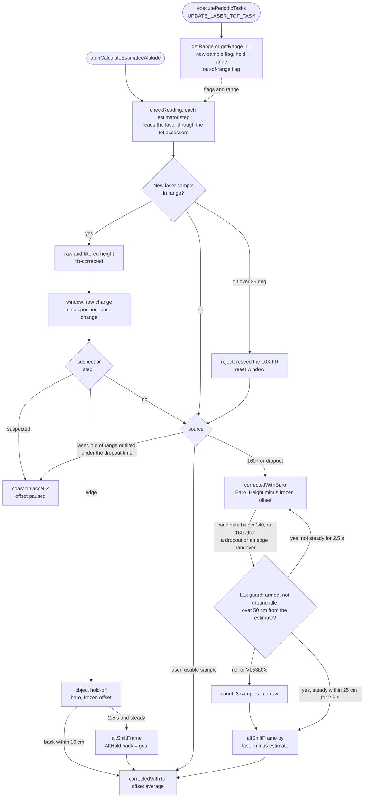

# PIPELINE_UPDATE: vl53l1x-althold-parity

[README](README.md) · [TASKS](TASKS.md) · [INVESTIGATION](INVESTIGATION.md) · [CHANGES](CHANGES.md) · [TESTING](TESTING.md)

Staged for commit. Applied by `pluto-commit`; do not edit `fw-architecture-pipeline/` before then.

## 1. What this replaces

Target: [`fw-architecture-pipeline/subsystems/Altitude_Hold_Estimator.md`](../../fw-architecture-pipeline/subsystems/Altitude_Hold_Estimator.md).
Each part in section 2 is the full replacement text for one place in that doc; paste it verbatim
over the text named in its heading. Everything else in the doc stays as it is.

| # | Place in `Altitude_Hold_Estimator.md` | Why |
|---|---|---|
| 2.1 | **Source Files**, the `**Laser**:` bullet | The VL53L1X driver now feeds the estimator too |
| 2.2 | **Primary Functions**, the `checkReading()` bullet | One body for either laser |
| 2.3 | The whole section ``## Laser fusion (`LASER_ALT`, VL53L0X)``, from its heading up to ( not including ) `## Flip interaction` | It said the fusion was VL53L0X-only and that the VL53L1X kept a hard 350 cm switch; both are obsolete. New: sensor interface, per-sensor constants, return guard, VL53L1X driver, known limits, updated flowchart |
| 2.4 | The ``- **ToF vs Baro**:`` bullet ( just above the last flowchart ) | Same obsolete 350 cm statement |

No other pipeline doc changes:

- `Firmware_Pipeline.md`: no new task or loop stage. `UPDATE_LASER_TOF_TASK` already calls
  `getRange_L1 ( )` under `LASER_TOF_L1x` ( `mw.cpp` `executePeriodicTasks ( )` ).
- `Hardware_Bus_Pipeline.md`, `IMU_Sensor_Fusion_Pipeline.md`, `User_Space_API.md`: they do not describe the
  laser path. No public API change, so no `docs/API/` update.
- No DMA / timer / pin change. The down-laser note in `PIN_MAP.md` and `dev-guide/HARDWARE_RESOURCES.md`
  is edited directly with this topic ( those files are not in the pipeline folder ).

**Flowchart edges.** Every edge in the new laser-fusion flowchart ( 2.3 ) is a call or a data path in
the source. The call edges between functions were confirmed with `graphify path` on 24 Sep 2026:
`apmCalculateEstimatedAltitude() → checkReading()` ( EXTRACTED ), `checkReading() → altShiftFrame()`,
`→ correctedWithTof()`, `→ correctedWithBaro()`, `→ tofWindowMismatch()` ( EXTRACTED ),
`executePeriodicTasks() → getRange_L1()` ( INFERRED; the source line is `mw.cpp:813` ). The graph also
reports an inferred `getRange_L1() → executePeriodicTasks()` edge in the wrong direction; the source
shows only the call above. The decision edges inside `checkReading ( )` are not graph edges; each is
cited to a source line in the comment under the diagram.

## 2. Replacement text

### 2.1 Source Files, `**Laser**:` bullet

Replace the one `- **Laser**: ...` bullet with this one:

---

- **Laser** ( one down-laser, only used by the estimator with `LASER_ALT` ): `src/main/drivers/ranging_vl53l0x.cpp` ( VL53L0X, `LASER_TOF`: 33 ms single ranging, `LASER_LPS` 0.1 IIR ) or `src/main/drivers/ranging_vl53l1x.cpp` / `.h` ( VL53L1X, `LASER_TOF_L1x`: Medium mode, 45 ms budget, 50 ms period, no filter ). Both sit on I2C1 at 0x29, so only one can be defined: `altitudehold.cpp` stops the build with an `#error` if both are, and if `LASER_ALT` is defined without either.

---

### 2.2 Primary Functions, `checkReading()` bullet

---

- `checkReading()` (with `LASER_ALT`): chooses the correction source each estimator step: `correctedWithTof()` on the laser, `correctedWithBaro()` with a frozen offset on the baro or during an object hold-off, or no correction ( coast ) during a short gap or a suspected edge. One body serves either laser; it reads the sensor only through accessor macros and per-sensor constants. See **Laser fusion** below.

---

### 2.3 Section `## Laser fusion`

---

## Laser fusion (`LASER_ALT`, VL53L0X or VL53L1X)

With a downward laser, altitude hold means height above the surface under the craft: gentle
terrain is followed. `checkReading()` decides each estimator step what corrects the complementary
filter. One fusion body serves both lasers, the VL53L0X ( `LASER_TOF` ) and the VL53L1X
( `LASER_TOF_L1x` ). Only one can be fitted: both sit on I2C1 at 0x29, and both would write the same
estimator state. Defining both stops the build with an `#error`, and so does `LASER_ALT` without a
laser. The two sensors differ only in the accessors and constants below, plus a return guard that
only the VL53L1X has.

**Sensor interface.** The body reads the sensor only through six accessor macros, chosen with
`#if defined( LASER_TOF ) / #elif defined( LASER_TOF_L1x )` near the top of `altitudehold.cpp`:

| Accessor | Meaning | VL53L0X | VL53L1X |
|---|---|---|---|
| `tofNew()` | a new result is waiting | `isTofDataNew()` | `isTofDataNew_L1()` |
| `tofClearNew()` | mark it consumed | `isTofDataNewflag = false` | `isTofDataNewflag_L1 = false` |
| `tofOutOfRange()` | no valid reading now | `isOutofRange()` | `isOutofRange_L1()` |
| `tofReseed()` | restart the driver's range filter | `tofRequestReseed()` | nothing ( no filter ) |
| `tofFiltCm()` | filtered range, cm, before the tilt correction | `NewSensorRange` ( the IIR ) / 10 | `NewSensorRange_L1` / 10 |
| `tofRawCm()` | unfiltered range, cm | `RangingMeasurementData.RangeMilliMeter` / 10 | `NewSensorRange_L1` / 10 |

Under `LASER_TOF` every accessor and constant expands to exactly the expression the VL53L0X-only code
used, so the refactor left the VL53L0X object code of `altitudehold.o` byte-identical.

What counts as a valid reading is decided in each driver:

| | VL53L0X | VL53L1X |
|---|---|---|
| Valid sample | range status 0 and < 2000 mm | range status 0 and `L1X_MIN_VALID_MM` 15 ≤ range < 4500 mm |
| Held range | `NewSensorRange`: IIR of valid samples | `NewSensorRange_L1`: the last valid sample |
| `tofOutOfRange()` also true | - | on a latched ST error ( `Global_Status_L1` ), or no new result for `L1X_STALE_MS` = 3P + 10 = 160 ms |

**Accelerometer input.** Under `LASER_ALT`, `accSum[Z]` is built without a deadband
( `ALT_EST_ACC_Z_DEADBAND` 0 counts, a compile-time constant, so a saved profile cannot bring the old
value back ). The profile's 40-count Z deadband ( ~9.6 cm/s² ) removed most of a hover's vertical
acceleration: `VelocityZ` read 0.3-0.4 × the real speed, the velocity loop had a third of its
damping, and the craft bobbed 30 cm at ~4 s. Baro-only builds keep `accDeadband.z`. `accSum[Z]`
also reaches the velocity loop's D term through `accZ_tmp`; at the default `d_vel` 1 the term is 0
until the sum of two consecutive averages ( `accZ_tmp + accZ_old` ) reaches 512 counts, ~256 per
sample.

**Filter.** One time constant `ALT_EST_TAU_S` 1.5 s for both sources. The laser error is taken
against the filter's `_position_z`, not the smoothed integer `EstAlt`. The correction runs on every
10 ms estimator tick with the last held `ToF_Height`, so its strength does not depend on the sensor's
sample period. Laser samples taken above `ALT_TOF_MAX_TILT_DECIDEG` 25° are rejected, for both
sensors; accepted ones are multiplied by the cosine of the tilt.

The VL53L0X driver IIR keeps float state and is reseeded from the raw sample after an out-of-range
sample, a rejected tilted sample, and at every object detection, cancel and re-base
( `tofRequestReseed()` ). It lags ~0.3 s ( `ALT_TOF_IIR_LAG_S` ), so the laser is advanced by
`VelocityZ × 0.3 s` for the baro-offset average and the return shift; the object
test advances the estimate by the same amount instead. The estimator correction itself uses the IIR
reading as it is. The VL53L1X has no driver filter: its lag is 0 and its reseed does nothing.

**Per-sensor constants.** P is `L1X_SAMPLE_PERIOD_MS`, 50 ms by default. The VL53L1X counts and
times are derived from P in macros ( with `static_assert`s on the steady count, the ring span and the
dropout against `L1X_STALE_MS` ), so a target that overrides the period gets consistent values.

| Constant | VL53L0X | VL53L1X | Meaning |
|---|---|---|---|
| Sample period | ~33 ms | P = 50 ms ( measured 51-53 ms ) | one new sample per period |
| `ALT_TOF_HANDOVER_UP_CM` / `_DOWN_CM` | 160 / 140 cm | 160 / 140 cm | laser → baro above, back below ( VL53L1X: 100 % valid to 180 cm on the test floor ) |
| `ALT_TOF_DROPOUT_MS` | 120 ms | 3P + 35 = 185 ms | no usable sample this long → baro ( 2 missed samples + poll quantisation + one estimator tick ) |
| `ALT_TOF_RETURN_SAMPLES` | 3 | 3 ( 150 ms ) | usable samples in a row to return to the laser |
| `ALT_TOF_IIR_LAG_S` | 0.3 s | 0 | driver-filter lag advanced by `VelocityZ` |
| `ALT_TOF_STEADY_SAMPLES` | 15 | 500 / P = 10 | 0.5 s steady before a re-base |
| `ALT_TOF_RING_LEN` | 24 | ceil ( 660 / P ) = 14 | window ring, ≥ 0.66 s of samples |
| `ALT_TOF_OFFSET_DT_MAX_S` | 0.05 s | 1.5 P = 0.075 s | longest step one baro-offset update weights |
| `ALT_TOF_RETURN_AGREE_CM` | - | 30 + 20 = 50 cm | return guard: largest laser-to-estimate disagreement accepted at once |
| `ALT_TOF_RETURN_STEADY_CM` | - | 25 cm | return guard: steady band of its exit |

Shared by both sensors: `ALT_EST_TAU_S` 1.5 s, `ALT_TOF_MAX_TILT_DECIDEG` 25°, `ALT_TOF_STEP_CM` 30 cm,
`ALT_TOF_STEP_HOLD_MS` 2.5 s, `ALT_TOF_STEADY_CM` 10 cm, `ALT_TOF_WINDOW_MS` 500 ms /
`ALT_TOF_WINDOW_MIN_MS` 400 ms, `ALT_TOF_SUSPECT_CM` 15 cm, `ALT_TOF_SUSPECT_MAX_MS` 1 s,
`ALT_TOF_SUSPECT_ESCALATE_CM` 20 cm, `ALT_TOF_AIRBORNE_GRACE_MS` 1 s, `ALT_BARO_OFFSET_TAU_S` 2 s.

**Handover** ( `altSourceLaser` ):

| From | To | When |
|---|---|---|
| laser | baro | the laser height ( filtered, tilt-corrected ) reads ≥ `ALT_TOF_HANDOVER_UP_CM` 160 cm; or no usable sample for `ALT_TOF_DROPOUT_MS` ( dropout, tilt, silent sensor ); or a suspected edge times out with the laser ≥ 160 cm, or an escalated edge gets no usable sample within `ALT_TOF_DROPOUT_MS` |
| baro | laser | `ALT_TOF_RETURN_SAMPLES` 3 usable samples below `ALT_TOF_HANDOVER_DOWN_CM` 140 cm after a climb above the band, otherwise below 160 cm. On the VL53L1X the return guard below can hold a sample off |

Short gaps: out-of-range and tilted samples coast on the accelerometer ( no correction ) until the
dropout timeout. A VL53L0X that simply stops reporting keeps its last reading usable, so the estimator
keeps correcting towards that reading until the 120 ms timeout. A silent VL53L1X does the same for
160 ms ( `L1X_STALE_MS` ), then coasts until the 185 ms timeout.

On the laser, `baro_offset` is a 2 s ( `ALT_BARO_OFFSET_TAU_S` ) average of baro minus laser, paused
during a hold-off, while a change is suspected, and for 400 ms after the window resets; the time step
of each update is clamped to `ALT_TOF_OFFSET_DT_MAX_S`, so the first sample after a pause gets a
normal weight. On the baro it is frozen. On the return, `altShiftFrame()` moves the frame by the laser
minus `_position_z` ( the baro drift since the handover, plus any change of surface ), so the numbers
change and the aircraft does not: `EstAlt` and `AltHold` move together, and the offset moves with
them. The baro ground datum ( `sensors/barometer.cpp` ) is never touched.

**Return guard ( VL53L1X only ).** On the baro nothing else checks what the laser sees: every object
test needs the laser as the source. In log-5 of this topic the VL53L1X read ceiling-fan blades below
the craft as a valid 54-57 cm for 4 samples with the craft at ~2.5 m, which would have returned to the
laser with a frame shift of about −2 m ( `E` ≈ 255 cm, readings 54-57 cm ). So, on the baro, armed and not in the pre-take-off ground
idle ( in flight and while landing ), a return candidate ( a new usable sample below the return edge )
whose laser height disagrees with `_position_z` by more than `ALT_TOF_RETURN_AGREE_CM` 50 cm
( `ALT_TOF_STEP_CM` 30 + `ALT_TOF_RETURN_BARO_CM` 20 for baro drift and noise ) is held off and resets
the return count. `_position_z` already carries the frozen offset, so the disagreement is the frame
shift the return would take.

Way out: if the disagreement ( laser minus estimate, not the raw reading, so the craft may climb,
descend or land meanwhile ) stays within `ALT_TOF_RETURN_STEADY_CM` 25 cm of its first value for
`ALT_TOF_STEP_HOLD_MS` 2.5 s, it is a new floor ( a take-off from a table, a long baro drift, an
object frame carried onto the baro ) and the return is taken on that sample with the normal frame
shift. Any gap, agreeing or out-of-band sample restarts the run; fan blades and passing objects are
intermittent and never last 2.5 s. The band is 25 cm, not the object test's 10 cm, because the
baro-path estimate swings 20-40 cm while the craft climbs or descends ( log-12: with 10 cm the exit took
~10 s ). Disarmed or in the ground idle the guard is off.

**Object under the craft** ( `altStepPending`, armed, airborne, not landing, on the laser, below
160 cm ). The raw laser ( tilt-corrected; before the IIR on the VL53L0X ) is tested two ways:

- **Per sample:** more than `ALT_TOF_STEP_CM` 30 cm from the lag-advanced estimate.
- **Window:** the raw change over the last `ALT_TOF_WINDOW_MS` 0.5 s minus the change of
  `_position_base_z` ( the accelerometer-integrated position; the laser's position correction does not
  move it, its velocity correction reaches it weakly ). The wide cone turns an edge into a 0.5-0.8 s
  ramp that the estimate would otherwise absorb. Above `ALT_TOF_SUSPECT_CM` 15 cm the reference is
  frozen, the laser correction pauses ( coast ) and the mismatch keeps adding up: above 30 cm it is
  an edge; after `ALT_TOF_SUSPECT_MAX_MS` 1 s, above `ALT_TOF_SUSPECT_ESCALATE_CM` 20 cm it is an edge
  that the next usable sample turns into a hold-off ( the baro takes over instead if the laser reads
  ≥ 160 cm or no usable sample arrives within `ALT_TOF_DROPOUT_MS` ); at or below 20 cm it is a slope
  that is then followed. A suspect is also cleared early when the accumulated mismatch falls below
  0.5 × `ALT_TOF_SUSPECT_CM` ( 7.5 cm ): laser and accelerometer agree again. No window test for `ALT_TOF_AIRBORNE_GRACE_MS` 1 s after becoming airborne.

An edge starts the hold-off: the estimate flies the baro with the frozen offset for at least
`ALT_TOF_STEP_HOLD_MS` 2.5 s. Three samples back within 15 cm cancel it. After 2.5 s, once the raw
reading has been steady within `ALT_TOF_STEADY_CM` 10 cm for `ALT_TOF_STEADY_SAMPLES` ( 0.5 s ),
`altShiftFrame()` re-bases the estimate to the new surface and `AltHold` is written back to its old
value ( or an active goal's end point, and the flip's return height ), so setpoint shaping flies back
to the old clearance as a goal ( 60 cm/s up, 30 cm/s down, the stick cancels it ). If landing starts
during a hold-off, the frame re-bases to the laser at once, so the step does not reach the estimator
as position error and touchdown detection is not delayed.

**Limits.** An object that stays under the craft and moves up with it re-bases it again each time
( no climb cap, by choice ). A slow slide can re-base on a half-way reading that is steady for
0.5 s; later triggers correct it. What is followed depends on how much the laser disagrees with
the accelerometer: up to ~15 cm within 0.5 s is followed at once; 15-20 cm coasts for up to 1 s and
is then followed; more than 30 cm within 0.5 s, or more than 20 cm building up within ~1 s, gets the
hold-off. A slope is followed when it changes the laser by less than ~30 cm/s ( 15 cm per 0.5 s
window ); a steeper one becomes an edge within about 0.5 s of turning suspect.

Known limits on the VL53L1X ( PRIMUS_X2_v1, `vl53l1x-althold-parity` flights log-10 to log-13 ):

- **Tilt above 25° is not flight-exercised.** The largest tilts logged were 18.2° on the bench and
  16.9° in flight. The rejection is the shared code flown on the VL53L0X.
- **The 25 cm guard-exit band is not flight-tested.** In log-13 the board was never in the beam. The
  guard held and its exit returned correctly in log-12, with the earlier 10 cm band.
- **Object frame after a re-base onto a close object** ( inherited from the VL53L0X ). After a re-base
  onto a close object and the climb back to the old clearance, removing the object with the craft
  above 160 cm hands over to the baro in the object's frame ( ~1.1 m off in log-12 ). The frame is
  corrected by the return guard's exit or the return.
- **Near-field take-off blip.** At lift-off the sensor briefly reads 0-12 mm with status 0, below the
  15 mm minimum: a baro leg of 0.1-0.2 s in flight ( bench estimate up to 0.3 s ), then a return with a frame shift of a few cm. No visible
  effect in flight.
- **Margin to the reach.** On the matt test floor the valid reach is ~1.8 m, 20 cm above the 160 cm
  edge. A darker floor or bright light shortens it; the dropout then hands over earlier.

**VL53L1X driver** ( `drivers/ranging_vl53l1x.cpp` / `.h`, `LASER_TOF_L1x` ).

- **Set-up** ( `ranging_init_L1()`, from `main.cpp` ): Medium distance mode, 45 ms timing budget,
  50 ms inter-measurement period ( TIMED ranging ), each step only if the previous one succeeded; an
  error latches in `Global_Status_L1`. The mode, budget and period are target-overridable
  ( `L1X_DISTANCE_MODE`, `L1X_TIMING_BUDGET_US`, `L1X_SAMPLE_PERIOD_MS` ), and a `static_assert` requires
  period ≥ budget + 5 ms ( ST refuses to start below budget + 4 ms, and the error would latch for the
  flight ).
- **One sample per measurement** ( `getRange_L1()`, from `UPDATE_LASER_TOF_TASK` ): data-ready is
  polled every 10 ms. On a new result the driver reads the 17-byte result block ( 0x0089-0x0099 ),
  clears the interrupt ( a 1-byte `SYSTEM__INTERRUPT_CLEAR` write ) and decodes the range status and
  range locally with the ST API's own mapping and arithmetic. It does not use
  `VL53L1_GetRangingMeasurementData` + `VL53L1_ClearInterruptAndStartMeasurement`. A sample poll costs
  ~0.79 ms of blocking I2C at 400 kHz ( 5.44 ms before ), once per 51-53 ms. The LL driver's own
  stream-count state is left stale on purpose ( it is only checked in back-to-back mode ). A
  `VL53L1_SetDistanceMode()` after start would no longer be applied; nothing calls it at runtime.
- **Limit checks on the device:** sigma 90 mm and minimum signal 1.5 MCPS, the preset tuning of
  both Medium and Long. They overwrite the 18 mm / 0.25 MCPS set by `VL53L1_DataInit`.
- **Measured reach** ( matt floor, Medium 45 / 50 ): 100 % valid to ~1.8 m, 50 % at ~1.95 m, ~0 above
  2.1 m ( status 2, signal fail ). Long mode gave no more reach: at 95 / 100 ms it stopped at the same
  ~1.8-2.0 m, and at 45 / 50 ms it was worse than Medium ( wrap-target fails, 1 % valid at a 20° tilt ).
  The likely limit is the 1.5 MCPS minimum signal.
- **On the ground** the craft reads 25-28 mm ( valid ); a covered window reads 0-10 mm with status 0,
  which the 15 mm minimum rejects.
- **A latched error is not recovered.** Any ST or I2C error, in set-up or at runtime
  ( `VL53L1_GetMeasurementDataReady`, `VL53L1_ReadMulti`, `VL53L1_clear_interrupt` ), latches in
  `Global_Status_L1` and stops ranging. `isOutofRange_L1()` then stays true and the estimator stays on
  the baro until a power cycle. This is a safe fallback; a recovery path is a follow-up.
- **Negative ranges.** `VL53L1_TUNING_PROXY_MIN` ( -30 mm ) is read at init. A valid result below it
  becomes invalid; one between it and 0 is clamped to 0, as the ST API does, and the 15 mm minimum then
  rejects it.
- **Public state:** `sampleCount_L1` ( new results since boot, valid or not ) and `lastSampleMs_L1`
  ( `millis()` at the last result, used for the staleness test ) are exported in the header.
- **Build check scope.** The period ≥ budget + 5 ms `static_assert` sits outside `#ifdef LASER_TOF_L1x`,
  so a bad `L1X_SAMPLE_PERIOD_MS` / `L1X_TIMING_BUDGET_US` override in a target breaks every build of that
  target, with or without the VL53L1X.
- The older `LaserSensor_L1` class ( `XVision`, full ST API ) is still compiled in every build but is not
  used by the estimator.

<!-- Edge sources ( 24 Sep 2026; graphify path for the function calls, source lines for the rest ):
Task -> Drv: mw.cpp:804-815 executePeriodicTasks ( ) UPDATE_LASER_TOF_TASK calls getRange ( ) / getRange_L1 ( ).
Est -> Tick: altitudehold.cpp:921 ( graphify: apmCalculateEstimatedAltitude -> checkReading, EXTRACTED ).
Drv -.-> Tick: ranging_vl53l1x.cpp:285-297 sets isTofDataNewflag_L1 / NewSensorRange_L1 / out_of_range_L1;
  ranging_vl53l0x.cpp:201-228 the L0X equivalents; read via the accessors altitudehold.cpp:179-184 / :219-224.
New -> Rej: altitudehold.cpp:1083-1090.  New -> Raw: :1092-1097.  Raw -> Win: :1118 tofWindowMismatch ( ).
Win -> Sus: :1128 ( suspect ), :1176-1177 ( step ).  Sus -> Hold: :1178.  Hold -> Laser ( cancel ): :1202-1203.
Hold -> Rebase: :1206-1218 altShiftFrame ( ).  Sus -> Coast / Band -> Coast: :1303-1306.  Band -> Laser: :1304.
Band -> BaroP: :1273-1279 ( handover ), :1309 correctedWithBaro ( ).  BaroP -> Guard: :1235-1236 ( L1x only ).
Guard -> BaroP: :1281-1282 ( returnHeld resets the count ).  Guard -> Ret ( steady exit ): :1237-1247.
Guard -> Cnt -> Ret: :1284-1289.  Ret -> Laser: :1291. -->

---

### 2.4 ``- **ToF vs Baro**:`` bullet

---

- **ToF vs Baro**: with `LASER_ALT` and either down-laser ( VL53L0X `LASER_TOF` or VL53L1X `LASER_TOF_L1x` ), the laser corrects the estimator below the handover band and the barometer above it ( **Laser fusion** above ). Without `LASER_ALT` the estimator is barometer and accel-Z only. `LASER_TOF` or `LASER_TOF_L1x` alone reads the laser for logging and does not affect altitude.

---

## 3. CHANGELOG entry ( applied at commit )

Into the open release section of `CHANGELOG.md` ( `## [vX.Y.Z]`, the topmost heading; `pluto-commit`
sets the version ). Merge with the existing laser bullets rather than duplicating them: the `Added`
bullet that starts "With `LASER_ALT` and the VL53L0X ( `LASER_TOF` )" can stay as it is, since the
`Fixed` bullet below extends it to the VL53L1X.

### Fixed

- **AltitudeHold ( laser, VL53L1X )**: With the VL53L1X ( `LASER_TOF_L1x` ) and `LASER_ALT`, the
  estimator kept correcting towards the last valid laser reading once the craft climbed past the
  sensor's reach ( ~1.9 m ): its branch used the laser while the height was between 0 and 350 cm and
  never checked for out of range, so the craft was pulled towards a stale height. Its tilt test also
  compared radians with 25 and never rejected, and its baro offset was a single sample. The VL53L1X now
  runs the same fusion as the VL53L0X: handover to the baro above 160 cm and back below 140 cm with a
  frozen offset and a frame shift on the return, a 185 ms dropout, tilt rejection above 25°, and the
  object hold-off with re-base. On PRIMUS_X2_v1, over four flights: a hands-off hover within ±3 cm 92 %
  of the time ( 8 cm peak to peak ), handovers with no height step, nine box hold-offs with re-base,
  baro hold within ±5 cm up to 3.1 m past the reach, and normal touchdowns.
- **Laser driver ( VL53L1X )**: The data-ready interrupt was never cleared, so every 10 ms poll re-read
  the same result and flagged it as new ( about 100 Hz of duplicates ). The driver now takes exactly one
  sample per measurement. A covered window reads 0-10 mm as a valid range; ranges under 15 mm now
  count as out of range ( the landed 25-28 mm stays valid, so landing is unchanged ). Out of range also
  covers a latched sensor error and a stall of more than 160 ms. A small negative range no longer wraps
  to about 65 m.

### Changed

- **Laser driver ( VL53L1X )**: 45 ms timing budget and 50 ms period in Medium mode ( was the ST
  default 41 ms / 100 ms ). The mode, budget and period can be overridden per target
  ( `L1X_DISTANCE_MODE`, `L1X_TIMING_BUDGET_US`, `L1X_SAMPLE_PERIOD_MS` ), with a compile-time check that
  the period is at least the budget + 5 ms. Each sample is fetched with one 17-byte result read and a
  1-byte interrupt clear, decoded with the ST API's own status mapping: 0.79 ms of blocking I2C per
  sample instead of 5.44 ms, which had stretched one 3.5 ms loop in about 15. Flash −2.1 KB.
- **AltitudeHold ( laser )**: One laser-fusion code path for both sensors. It reads the sensor through
  per-sensor accessors and constants; the VL53L0X object code is byte-identical to before. The build
  stops with an `#error` if both `LASER_TOF` and `LASER_TOF_L1x` are defined ( both are at I2C 0x29 ),
  or if `LASER_ALT` is defined without a laser.
- **Firmware version**: add ", X.Y.Z for the VL53L1X ( `LASER_TOF_L1x` ) altitude-hold fusion" to the
  existing version bullet ( FW minor bump, API unchanged at 1.3.2; `pluto-commit` sets the number ).
  The shipped `target.h` keeps the laser defines off, so the default build is unchanged ( 98.9 KB /
  14.8 KB ); a VL53L1X + `LASER_ALT` build is about 110 KB / 16.1 KB ( 110.1 KB after the task 10 clean-up; the
  flown image with its temporary log was 111.0 KB ).

### Added

- **AltitudeHold ( laser, VL53L1X )**: Return guard on the baro → laser return. In flight, a laser
  reading more than 50 cm from the current estimate is not taken as the floor unless the disagreement
  stays steady within 25 cm for 2.5 s ( a real new floor, such as a take-off from a table ). A VL53L1X
  looking down past a ceiling fan read the blades as a valid 56 cm for four samples at 2.5 m, which would
  have shifted the altitude frame by about −2 m.

### Documentation

- `fw-architecture-pipeline/subsystems/Altitude_Hold_Estimator.md`: **Laser fusion** covers both lasers,
  with the sensor accessors, a per-sensor constants table, the VL53L1X return guard, the VL53L1X driver
  and its known limits.
- `CLAUDE.md`: the flip and `LASER_ALT` paragraphs moved into `dev-guide/FLIGHT_INVARIANTS.md`, with one
  line each left in *Flight invariants*.
- `PIN_MAP.md`, `dev-guide/HARDWARE_RESOURCES.md`: one down-laser at 0x29 on I2C1; VL53L0X and VL53L1X
  are mutually exclusive.
