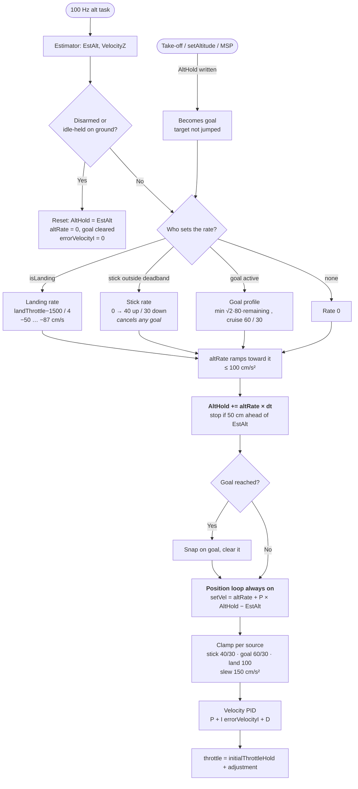
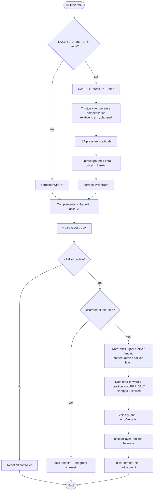

# Altitude Hold & Estimator (`altitudehold.cpp`)

## Overview
Fuses barometric pressure (and, when `LASER_ALT` is defined, laser Time-of-Flight) with the accelerometer's Z-axis to estimate altitude and vertical velocity. When `ALT_HOLD` mode is active, it takes over the throttle channel to hold or smoothly change height.

## Source Files
- **Altitude estimator and controller**: `src/main/flight/altitudehold.cpp`, `src/main/flight/altitudehold.h`
- **Barometer chain**: `src/main/sensors/barometer.cpp` (conversion, zero, compensation), `src/main/drivers/barometer_icp10111.cpp` (ICP-10111 driver)
- **Laser**: `src/main/drivers/ranging_vl53l0x.cpp` (only used by the estimator with `LASER_ALT`)
- **XY position** (not altitude): `src/main/flight/posEstimate.cpp`, `src/main/flight/posControl.cpp`

## Key Data Structures
- `EstAlt`: estimated altitude in cm. What the controller and `limitAltitude()` use.
- `VelocityZ`: estimated vertical velocity in cm/s.
- `BaroAlt`: compensated barometric altitude in cm, the measurement the estimator is corrected towards. Noisier than `EstAlt` by design.
- `AltHold`: the altitude setpoint. Moved by the setpoint shaping below; a write from outside becomes a goal ( `altGoal` ) rather than a step. `altTarget` is its float copy.
- `altRate`: the ramped rate moving `AltHold` ( stick rate or goal profile ), fed forward to the velocity loop.
- `initialThrottleHold`: the hover-throttle baseline. `errorVelocityI` (the only alt-hold integrator) carries the residual trim.

## Primary Functions
- `apmCalculateEstimatedAltitude()`: runs the third-order complementary filter each altitude task, integrating accel-Z and correcting towards the height measurement.
- `checkBaro()` → `correctedWithBaro()`: barometer path (no `LASER_ALT`). Time constant `_time_constant_z` is 2 s, or 5 s above 30° of tilt.
- `checkReading()` → `correctedWithTof()`: with `LASER_ALT`, laser below 200 cm (hard switch, no blend), barometer above, with `baro_offset` aligning the two at handover.
- `applyAltHold()` → `applyMultirotorAltHold()` (main loop): turns the throttle stick into `setVelocity` (or the landing descent while `isLanding`), sets `altHoldGroundIdle`, and writes `rcCommand[THROTTLE] = initialThrottleHold + altHoldThrottleAdjustment`.
- `calculateAltHoldThrottleAdjustment()` (100 Hz): setpoint shaping, then the outer position loop (`P8[PIDALT]`, 128 = unity) plus the fed-forward rate, feeding the inner velocity loop.
- `offloadHoverTrim()`: while settled, moves hover trim from `errorVelocityI` into `initialThrottleHold` one count per 20 ms, keeping the integrator's range free.
- `limitAltitude()`: altitude ceiling at `max_altitude - ALT_CEILING_MARGIN_CM` (25 cm).

## Barometer chain (`sensors/barometer.cpp`)

The ICP-10111 does not report the true static pressure of the air: rotor inflow and the board's heating both shift it. The chain from raw reading to `BaroAlt`:

1. **Driver** (`barometer_icp10111.cpp`): `NORMAL` measurement mode (~7 ms conversion). Die temperature is low-pass filtered (`TEMP_LPF_ALPHA`) and feeds the sensor's own compensation polynomial.
2. **Compensation** (`baroCompensationPa()`): adds back pressure lost to throttle and temperature, relative to the values latched at the arm instant, so it is zero on the first armed sample:
   - `BARO_COMP_THROTTLE_PA_PER_COUNT` = 0.0086 Pa per `rcCommand[THROTTLE]` count
   - `BARO_COMP_TEMP_PA_PER_DEGC` = 2.1 Pa per °C of die temperature (measured −2.17 to −2.42 on PRIMUS_V5)
   - total clamped to ±`BARO_COMP_LIMIT_PA` (25 Pa, ~2 m)
3. **Conversion** (`pressureToAltitude()`): ISA standard atmosphere at a fixed 288.15 K. Deliberately temperature-free, so the scale does not depend on how warm the board is. About 8.3 cm per Pa near sea level.
4. **Zero** (`baroUpdateZero()`): while disarmed, an IIR tracks the reading so warm-up before takeoff is absorbed; frozen on arm. Applied as an offset (`getBaroZeroOffset()`).

`BaroAlt = altitude(pressure + compensation) − ground altitude − zero offset`.

Rules that keep this working:
- **Never re-zero in flight.** `baroResetGroundLevel()` is only allowed before the throttle has been raised since arming (`throttleRaisedSinceArm` in `mw.cpp`).
- **Keep estimator lag low.** A slow estimate lags high during a descent and commands more descent; adding filtering to `BaroAlt` trades noise for exactly this.
- **Coefficients are per airframe.** The throttle term depends on where the FC sits relative to the rotors. Re-measure on a new frame from a log of `degC`, `PaI` and laser height over a 3+ minute hover.

## Data Flow & Boundaries
- **Stick deadband**: in `ALT_HOLD`, `alt_hold_deadband` (40 counts, stick 1460-1540) is applied to the throttle stick. Inside it the drone holds altitude; beyond it, the stick sets a climb/descent rate. There is no deadband on the position error.

## Setpoint shaping (`calculateAltHoldThrottleAdjustment()`)

ArduPilot / DJI style: the throttle stick never takes the position loop out of the chain. It moves the setpoint, and the loop tracks the moving setpoint with the rate fed forward.

Why it is built this way:
- **One controller, no mode switch.** Earlier firmware switched to a raw velocity command outside the deadband and snapped `AltHold` to `EstAlt` on return. That gave a speed step at the deadband edge and an overshoot on centring.
- **Feed-forward instead of a gap.** A P = 1 position loop needs a 60 cm error to demand 60 cm/s, so a stepped target is approached ever more slowly. Feeding the planned rate forward leaves the position term as a small correction.
- **Height stays controlled while the stick is in use**, and stick, commands and landing are all bounded by the same ramp and clamp.

The legacy flow, the full comparison and the reasoning are in [althold-setpoint-shaping/CHANGES.md](../../active-development/althold-setpoint-shaping/CHANGES.md#before--after).

| Source of `altRate` | Rate | Limits |
|---|---|---|
| **Stick** outside the deadband | Linear from 0 at the deadband edge to full stick | `ALT_MAX_CLIMB_CMS` 40 / `ALT_MAX_DESCENT_CMS` 30 cm/s |
| **Goal**: `AltHold` written from outside (take-off, `DesiredPosition_set*` / `setAltitude()`, MSP) | Trapezoid: `min(sqrt(2·a·remaining), cruise)`, stops on the goal | Cruise `ALT_CMD_MAX_CLIMB_CMS` 60 / `ALT_CMD_MAX_DESCENT_CMS` 30 cm/s, brake `ALT_GOAL_DECEL_CMSS` 80 cm/s² |
| **Landing** (`isLanding`) | `(landThrottle − 1500) / 4`: land() ramps 1300 → 1150, i.e. about −50 → −87 cm/s | Descent clamp `ALT_LAND_MAX_DESCENT_CMS` 100 |

Each 10 ms tick:
1. `altRate` ramps toward the source rate at `ALT_STICK_ACCEL_CMSS` (100 cm/s²). Moving the stick cancels a goal.
2. `AltHold += altRate · dt`. It stops advancing when it is `ALT_TARGET_LEASH_CM` (50) ahead of `EstAlt` in the direction of travel, e.g. while still on the ground.
3. Velocity demand = `altRate + P_ALT · (AltHold − EstAlt)`. It is clamped to the limits of the active source and slewed at `ALT_VEL_ACCEL_CMSS` (150 cm/s²), then goes to the velocity PID.

Behaviour that follows: centring the stick lets the target coast to a stop, with no snap to `EstAlt` and no overshoot. A 120 cm take-off takes about 2.7 s with no slow final approach.

Flow of `calculateAltHoldThrottleAdjustment()`:

**Ground reset:** while disarmed, or armed on the throttle stick with the motors held at 1000 (`isThrottleStickArmed` → `altHoldGroundIdle`), the setpoint, goal, rate and `errorVelocityI` are held in reset. Waiting armed on the ground therefore cannot wind the integrator down.

**Landing must keep its own descent rate.** Near the floor the barometer drifts low in the craft's own downwash. At the stick's 10-20 cm/s that drift alone met the descent demand: the craft hovered a few cm up with `EstAlt` still falling, and `land()`'s touchdown test (descent stopped) never fired.

**Not covered:** there is no general landed detector. A touchdown and re-take-off without disarming can still wind the integrator down. `limitAltitude()` only clamps the stick, and the target coasts about 8 cm past the clamp, which is inside the 25 cm margin.
- **ToF vs Baro**: with `LASER_ALT`, the VL53L0X (200 cm) or VL53L1X (350 cm) replaces the barometer below its range. Without it, the estimator is barometer and accel-Z only. `LASER_TOF` alone reads the laser for logging and does not affect altitude.

